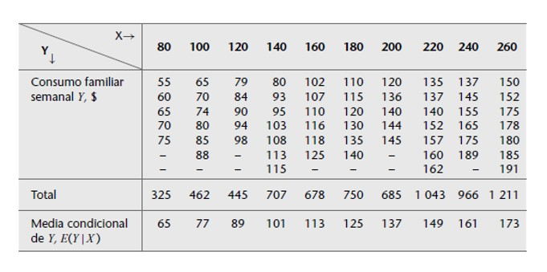
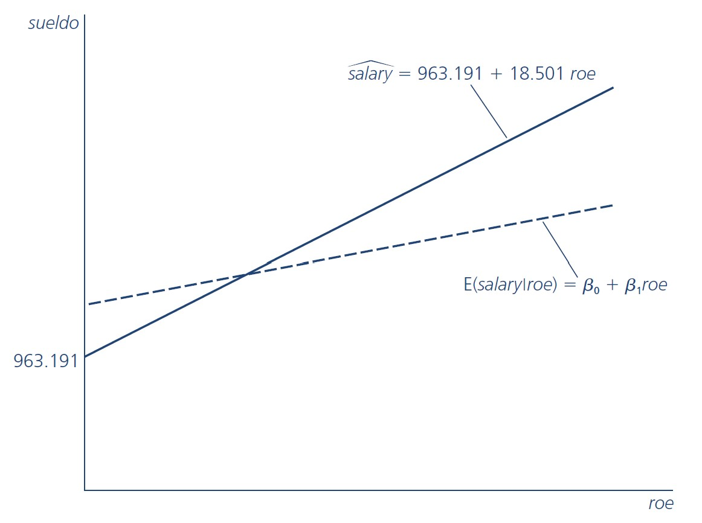

```{r setup, include = FALSE}
library(knitr)                              # paquete que trae funciones utiles para R Markdown
library(tidyverse)                          # paquete que trae varios paquetes comunes en el tidyverse
library(datos)                              # paquete que viene con datos populares traducidos al español :)
library(shiny)
# opciones predeterminadas
knitr::opts_chunk$set(echo = FALSE,         # FALSE: los bloques de código NO se muestran
                      dpi = 300,            # asegura gráficos de alta resolución
                      warning = FALSE,      # los mensajes de advertencia NO se muestran
                      error = FALSE)        # los mensajes de error NO se muestran


options(htmltools.dir.version = FALSE)
```

class: inverse, left, bottom
background-image: url("img/fondo.jpg")
background-size: cover


# **`r rmarkdown::metadata$title`**
----

## **`r rmarkdown::metadata$subtitle`**

### `r rmarkdown::metadata$author`
### `r rmarkdown::metadata$date`

```{r xaringanExtra-share-again, echo=FALSE}
xaringanExtra::use_share_again()
```

```{r xaringanExtra-clipboard, echo=FALSE}
xaringanExtra::use_clipboard()
```

---
name: hola
class: inverse, middle, center

# Universidad del Valle

--

## Maestría en Analítica e Inteligencia de Negocios


---


.pull-left[

<br><br><br><br><br>

```{r echo=FALSE, out.width = "110%" }
knitr::include_graphics("img/gif1.gif")
```
]

<br><br><br><br><br>


.pull-right[
# Orlando Joaqui-Barandica
### [www.joaquibarandica.com](https://www.joaquibarandica.com)
 *PhD.(C) in Industrial Engineering* 
 
 *MSc. Applied Economics*
 
 *BSc. Statistics*
]

---


name: Casos
class: inverse, center, middle

# `r icon("sort-numeric-up")`
# CASOS
----

.right[
.bottom[
####  [`r icon("bell")`](#menu)
]
]

---


# Casos


.pull-left[

* .font110[Imagine que el gobierno lo contrata para evaluar la efectividad de un programa de capacitación para el trabajo financiado con fondos públicos. Suponga que se trata de un programa para instruir a los trabajadores sobre diversas maneras de utilizar las computadoras en los procesos de fabricación.]


* .font110[Este programa, de veinte semanas, ofrece cursos en horarios fuera de la jornada laboral. Cualquier trabajador de la industria puede participar e inscribirse de manera voluntaria a todo el programa o a una parte de él. ]

]

.pull-right[

.center[ 
### Usted tiene que determinar si este programa de capacitación laboral tiene algún efecto sobre los posteriores salarios por hora de los trabajadores.


.orange[.font180[**¿Qué hacer?**]]]


]


---


class: center, middle

### En este caso no se necesita una teoría formal. Una comprensión básica de la economía es suficiente para advertir que factores tales como la educación, la experiencia y la capacitación laboral afectan la productividad de los trabajadores.

--


### Los analistas saben que a los trabajadores se les paga en razón de su productividad

--

.brand-charcoal[.font150[$$salario = f(educ, exper, capacitación)$$]]


.left[
Dónde,

- *salario* =  Salario por hora
- *educ* = años de escolaridad formal
- *exper* =  años de experiencia
- *capacitación* = semanas de capacitación laboral
]

.gray[.right[Claramente hay otros factores que influyen, <br> pero este planteamiento encierra la escencia del problema]]

---

class: center, middle, inverse
background-image: url(https://media.giphy.com/media/42HJ26S7bvbmVhcaR2/giphy.gif)
background-size: cover

# Qué características tiene cada una de las variables identificadas?

<br>

.white[.font180[$$salario = f(educ, exper, capacitación)$$]]


---


# Casos


* .font150[Un proyecto de investigación de la alcaldía de Cali quiere establecer los factores que influyen en que un ciudadano utilice o no el servicio del MIO.. ]

.center[.orange[.font180[**¿Qué hacer?**]]]

--

<br>

* .font150[El mismo proyecto anterior tiene una variante en su etapa IV de desarrollo. Ahora, se quiere establecer qué factores influyen para que un ciudadano se movilice en Moto, Carro y Servicio Público (Bus, MIO, Etc)...] 

.center[.orange[.font180[**¿Qué hacer?**]]]


---


# Casos


* .font150[Se desea modelar la percepción de la última feria de Cali realizada en el 2017, la cuál fue evaluada mediante una encuesta socioeconómica, en dónde los encuestados calificaron entre `Muy buena`, `Buena`, `Regular` y `Mala`.]

.center[.orange[.font180[**¿Qué hacer?**]]]

--

<br>

* .font150[El observatorio económico regional tiene el principal interés de evaluar cuales son los factores que determinan la decisión de estudiar y trabajar de manera simultánea en los ciudadanos.] 

.center[.orange[.font180[**¿Qué hacer?**]]]


---


# Casos


* .font150[La responsabilidad social corporativa es un factor muy importante para las empresas. Por tal motivo las empresas divulgan información de sus actividades de tipo medio ambiental, laboral, comunidad, entre otras, año tras año. ¿Qué factores inciden en la divulgación de información de RSC de las empresas durante los años 2015 a 2018?]

.center[.orange[.font180[**¿Qué hacer?**]]]


---


name: Metodologia
class: inverse, center, middle

# `r icon("broom")`
# Metodología de la modelación
----

.right[
.bottom[
####  [`r icon("bell")`](#menu)
]
]

---

class: center, middle, inverse
background-image: url(https://media.giphy.com/media/YK257LnLWgGR2/giphy.gif)
background-size: cover


# ¿Cómo proceden los analistas en el análisis de un problema? 

#Es decir, ¿cuál es su metodología?

---

# Metodología


.font140[
> 1. .orange[Planteamiento de la teoría o de la hipótesis.]

> 2. Especificación del modelo matemático de la teoría.

> 3. .orange[Especificación del modelo estadístico de la teoría.]

> 4. Obtención de datos.

> 5. .orange[Estimación de los parámetros del modelo]

> 6. Pruebas de hipótesis.

> 7. .orange[Pronóstico o predicción.]

> 8. Utilización del modelo para fines de toma de decisiones.
]


---


# 1. Planteamiento de la teoría o de la hipótesis.


## Keynes plantea:

.font120[.orange[La ley psicológica fundamental… consiste en que los hombres [y las mujeres], como regla general y en promedio, están dispuestos a incrementar su consumo a medida que aumenta su ingreso, pero no en la misma cuantía del aumento en su ingreso.]]


.pull-left[
----
### En pocas palabras, Keynes postula que la *propensión marginal a consumir* (PMC), es decir, la tasa de cambio del consumo generado por una unidad (digamos, un dólar) de cambio en el ingreso, es mayor que cero pero menor que uno.
----
]


.pull-right[
.center[

]]


---


# 2. Especificación del modelo matemático de la teoría.


## Keynes plantea:

.font120[.green[A pesar de haber postulado una relación positiva entre el consumo y el ingreso, Keynes no especifica la forma precisa de la relación funcional entre ambas cosas. Por simplicidad, un economista matemático puede proponer la siguiente forma de la función keynesiana de consumo:]]

.font140[$$Y = \beta_0 + \beta_1X$$]

donde $Y$ = gasto de consumo y $X$ = ingreso. El coeficiente de la pendiente $\beta_1$ mide la PMC. 

.center[
### Esta ecuación plantea que el consumo esta relacionado linealmente con el ingreso, y es un ejemplo de un modelo matemático de la relación entre consumo e ingreso, llamada en economía función  consumo.
]

---

# 3. Especificación del modelo estadístico de la teoría.

.font120[Para dar cabida a relaciones inexactas entre las variables económicas, el analista modificaría la función determinista de consumo en la ecuación de la siguiente manera:]

<br>

.font140[$$Y = \beta_0 + \beta_1X + u$$]

u: Término de perturbación o de error, <br>
Variable aleatoria con propiedades probabilísticas bien definidas. 

<br>

.font140[*El término de perturbación $u$ representa* **.orange[todos los factores]** *que afectan el consumo pero que* **no se consideran en el modelo en forma explícita**.]

---

# 4. Obtención de datos

.font140[Para estimar el modelo se deben obtener los valores numéricos de] $\beta_0$ y $\beta_1$, .font140[para esto son necesarios los datos.]


.pull-left[
<br>

----

.orange[.font180[Ejemplo:]] .font120[se utilizan cifras relacionadas con la economía de Estados Unidos de 1960 a 2005. La variable *Y* es el gasto de consumo personal (GCP) agregado (para la economía en su conjunto), y la variable *X*, el producto interno bruto (PIB), una medida del ingreso agregado, ambos medidos en miles de millones de dólares base año 2000.]

----

]


.pull-right[
.center[

]]


---


# 5. Estimación de los parámetros del modelo

.font120[El análisis de regresión es la herramienta principal para obtener las estimaciones. Con esta técnica y los datos obtuvimos los siguientes valores estimados de] $\beta_0$ y $\beta_1$, .font120[a saber, -299.5913 y 0.7218. Así, la función consumo estimada es]

<br>

.font140[$$\hat{Y} = -299.5913 + 0.7218X$$]

>El coeficiente de la pendiente (es decir, la PMC) fue de alrededor de 0.72, lo que indica que:

<br>

### Para el periodo muestral un incremento de un dólar en el ingreso real produjo, en promedio, un incremento cercano a 72 centavos en el gasto de consumo real. Decimos en **promedio** porque la relación entre consumo e ingreso es inexacta.


---

# 6. Pruebas de Hipótesis

.font120[En el supuesto de que el modelo ajustado sea una aproximación razonablemente buena de la realidad, tenemos que establecer criterios apropiados para comprobar si los valores estimados obtenidos, por ejemplo, concuerdan con las expectativas de la teoría que estamos probando.]

<br>

.center[
##Keynes esperaba que la PMC fuera positiva pero menor que 1. 
]

.font120[.orange[**En el ejemplo observamos que la PMC es alrededor de 0.72.** Pero antes de aceptar este resultado como confirmación de la teoría keynesiana de consumo, debemos averiguar si esta estimación está lo bastante abajo de la unidad para convencernos de que no se trata de un suceso debido al azar o de una peculiaridad de los datos.] 

**En otras palabras,** ¿Es 0.72 estadísticamente menor que 1? Si lo es, puede apoyar la teoría de Keynes.]


---

# 7. Pronóstico o predicción.

.font120[Suponga que queremos predecir la media del gasto de consumo para 2006. El valor del PIB para 2006 fue de 11 319.4 millones de dólares.]

.font140[$$\hat{Y}_{2006} = -299.5913 + 0.7218(11319.4) = 7870.75$$]

----

> Con ese valor del PIB, la media o el promedio del gasto de consumo previsto es de alrededor de 7 870 millones de dólares. El valor real del gasto de consumo registrado en 2006 fue de 8 044 millones de dólares. 

----

.pull-left[
### El modelo estimado subpredijo el gasto de consumo real por casi 174 000 millones de dólares.]

.pull-right[
Se diría que el error de predicción es de aproximadamente 174 000 millones de dólares, que representa alrededor de 1.5% del valor real del PIB para 2006.
]

---

# 8. Utilización del modelo para toma de decisiones.

.center[

]

.center[
### Un modelo estimado sirve para fines de control o de políticas públicas. Mediante una mezcla apropiada de política fiscal y monetaria, el gobierno puede manejar la variable de control X para producir el nivel deseado de la variable objetivo Y.
]


---


name: Causalidad
class: inverse, center, middle

# `r icon("dice-d6")`
# Causalidad
----

.right[
.bottom[
####  [`r icon("bell")`](#menu)
]
]

---

# Causalidad

.font120[.green[A pesar de que el análisis de regresión tiene que ver con la dependencia de una variable respecto de otras variables, esto no implica causalidad necesariamente.]]

<br>
.pull-left[

> .font120[`Una relación estadística, por más fuerte y sugerente que sea, nunca podrá establecer una conexión causal: nuestras ideas de causalidad deben provenir de estadísticas externas y, en último término, de una u otra teoría `]

]

.pull-right[
.center[

]


]

---

class: inverse, center, middle
background-image: url(https://media.giphy.com/media/VdKEHcPsjrlQv9Cv5n/giphy.gif)
background-size: cover


# Causalidad

<br>
<br>

## En un ejemplo de rendimiento del cultivo, no hay una razón estadística para suponer que la lluvia no depende del rendimiento del cultivo.


## Considerar que el rendimiento del cultivo depende de la lluvia (entre otras cosas) se debe a cuestiones no estadísticas: el sentido común indica que la relación no puede ser a la inversa, pues no es posible controlar la lluvia mediante el rendimiento del cultivo.

---


# Causalidad

> .font140[En la mayoría de las pruebas de teorías económicas, así como en la evaluación de políticas públicas, **el objetivo de los analistas** es inferir que una variable (por ejemplo, la educación) .orange[**tiene un efecto causal**] sobre otra variable (por ejemplo, la productividad de los trabajadores).]

<br> 
> .font140[Encontrar simplemente una relación entre dos o más variables puede ser sugestivo, pero no concluyente, a menos que pueda establecerse causalidad.]

<br>

> .font140[El concepto **ceteris paribus** —.orange[**"si todos los demás factores relevantes permanecen constantes"**]— tiene un papel importante en el análisis causal.]

---


# Causalidad


.font180[$$salario = f(educ, exper, capacitación)$$]

.font120[.orange[En este ejemplo, interesa conocer el efecto de una semana más de capacitación sobre el salario, cuando los demás componentes en particular Educ y Exper, permanecen constantes.]]

- .font130[Si se logran mantener constantes todos los demás factores relevantes...]
- .font130[... y se encuentra una relación entre **capacitación laboral** y **salarios**]

--

.center[
### Puede concluirse que tal capacitación tiene un efecto causal sobre la productividad de los trabajadores.
]

.font120[A pesar de que esto puede parecer bastante sencillo, aun ya en este nivel inicial debe ser claro que, .green[**salvo en casos muy especiales, no será posible mantener, literalmente, todo lo demás sin cambio.**]]


---

# Causalidad

.font120[La pregunta fundamental en la mayor parte de los estudios empíricos es: ]

<br>
.center[
## ¿se han mantenido constantes suficientes factores para que se justifique la causalidad?
]

<br>

- .font130[En la mayoría de los casos, las hipótesis en las ciencias sociales son de carácter ceteris paribus, es decir, para estudiar una relación entre dos variables todos los demás factores relevantes deben mantenerse constantes.]

- .font130[En las ciencias sociales, dado el carácter no experimental de la mayor parte de los datos que suelen recolectarse, hallar relaciones causales no es una tarea fácil.]


---

class: center, middle

# Datos experimentales $\neq$ Datos no experimentales

.font200[🚩🚩🚩]

---

name: TipoDatos
class: inverse, center, middle

# `r icon("database")`
# Tipos de datos
----

.right[
.bottom[
####  [`r icon("bell")`](#menu)
]
]

---


# Tipos de datos

.pull-left[
### Las bases de datos estructurados pueden ser de diversos tipos. 

.font130[
>Aunque algunos métodos pueden ser empleados, con alguna o ninguna pequeña modificación, para distintos tipos de bases de datos, las características especiales de algunas bases de datos deben ser tomadas en cuenta y aprovecharse.]
]

.pull-right[
<br>
<br>
<br>
<br>
* ###Datos de corte transversal
* ###Datos de serie de tiempo
* ###Combinación de cortes transversales
]

---


name: LinealSimple
class: inverse, center, middle

# `r icon("database")`
# Análisis de regresión lineal
----

.right[
.bottom[
####  [`r icon("bell")`](#menu)
]
]


---

# Análisis de regresión lineal

<br>

El objetivo del análisis de regresión es el de construir una función que aproxime de la mejor manera el comportamiento de una variable aletoaria $(Y)$ a través del conocimiento previo del valor de una variable explicativa $(X)$, mediante una expresión lineal como la siguiente:

<br>

.font180[$$Y = \beta_0 + \beta_1X$$]

<br>

> - Y: es llamada la variable de respuesta o dependiente
> - X: es llamada la variable predictora o independiente
> - $\beta_0$: es el intercepto de la linea con el eje $Y$
> - $\beta_1$: es la pendiente de la linea de regresión


---

class: center

## Este modelo supone una **asociación lineal** entre las variables de estudio, por tanto antes de empezar, esta relación debe ser valorada


.pull-left[

```{r, warning=FALSE, echo=FALSE, message=FALSE, fig.height=5}


plot(iris$Petal.Length,iris$Petal.Width, main="Gráfico de dispersión")


# cor(iris$Petal.Length,iris$Petal.Width)


```


Correlación entre `Petal.Length` y `Petal.Width` 0.96


]


.pull-right[

```{r, warning=FALSE, echo=FALSE, message=FALSE, fig.height=6.5}

library(ggcorrplot)

ggcorrplot(cor(iris[,-5]))

```


]


---

# Análisis de regresión lineal

<br>

El análisis de regresión se relaciona en gran medida con la estimación o predicción de la .orange[**media (de la población) o valor promedio de la variable dependiente,**] con base en los valores conocidos o fijos de las variables explicativas.

<br>

> Las observaciones de la variable $Y$ (dependiente) se asumen aleatorias de una distribución con media $E(Y|X=x)$. 

> Las desviaciones de las observaciones $y_i$ de la $E(Y|X=x)$ se tienen en cuenta adicionando un error aleatorio $u_i$ al siguiente modelo:

.font180[$$y_i = \beta_0 + \beta_1 x_i + u_i$$]


---

# Ejemplo

Estos datos se refieren a la población total de 60 familias de una comunidad hipotética, así como a su ingreso semanal $(X)$ y su gasto de consumo semanal $(Y)$, en dólares. Las 60 familias se dividen en 10 grupos de ingresos (de 80 dólares a 260); asimismo, aparecen los gastos semanales de cada familia de los diversos grupos. Por consiguiente, hay 10 valores fijos de $X$ y los correspondientes valores $Y$ para cada valor $X$; así, hay 10 subpoblaciones $Y$.


.center[



]


---

# Ejemplo

> En total hay 10 valores medios para las 10 subpoblaciones de Y. A estos valores medios se les llama valores esperados condicionales: $E(Y|X)$.

<br>

.pull-left[

Es importante distinguir entre los valores esperados condicionales y el valor esperado incondicional: $E(Y)$.


$$E(Y|X) \neq E(Y)$$


Si sumamos los consumos semanales de las 60 familias que forman la población y dividimos este número entre 60, obtendremos la cantidad de 121.20 dólares (7272/60), que es el .orange[**valor de la media incondicional**], o esperada, del consumo semanal, $E(Y)$.

]

.pull-right[

.center[


]

]


---

<br><br>


### Esta figura muestra que para cada X (es decir, el nivel de ingresos) existe una población de valores Y (consumo semanal) que se distribuyen alrededor de la media (condicional) de dichos valores Y.


---


name: MCO
class: inverse, center, middle

# `r icon("database")`
# Mínimos cuadrados ordinarios
----

.right[
.bottom[
####  [`r icon("bell")`](#menu)
]
]

---


# Modelo de regresión lineal

<br>
<br>

Modelo especial en el que la descomposición ortogonal

<br>


.font200[$$Y = E(Y|X) + U$$]

<br>


> Es tal que $E(Y|X)$ es una función lineal de $x_n$

> $Var(Y|X)$ es constante.


---

# Modelo de regresión lineal

<br>

.pull-left[

> .font140[Hay .orange[tres supuestos generales] de un modelo econométrico que garantizan la existencia de una descomposición ortogonal como la del modelo clásico de regresión lineal.]

]

.pull-right[

.center[

## - Linealidad

## - Exogeneidad estricta

## - Perturbaciones esféricas

]

]

---


# MCO


.font140[En el análisis de regresión lineal el objetivo es utilizar los datos para trazar una línea que represente mejor la relación entre dos variables.]

.pull-left[

.center[

### Ya que se puede trazar más de una recta que razonablemente se ajuste a la distribución de los datos, es preferible utilizar el método de los **mínimos cuadrados** que resulta en una sola y mejor línea de regresión *.orange[(Recta del mejor ajuste)]*.
]
]

.pull-right[
<br>
.center[

]
]

> **Mínimos Cuadrados Ordinarios (MCO):** El objetivo de este procedimiento es estimar los parámetros tal que la suma de cuadrados (SC) de las diferencias entre las observaciones (valores reales) y la línea recta estimada sea mínima (Min SCError).


---

# MCO

Si lo que interesa es minimizar la suma de cuadrados del error...


.center[
### ¿Qué es el error?
]

--

.font1800[$$\hat{e}_i = y_i - \hat{y}_i$$]

### Entonces, interesa...


.pull-left[
.center[

]
]

.pull-right[

<br>
$$SCE = \sum_{i=1}^n (y_i - \hat{y}_i)^2$$
]

---

# MCO

### Minimizar SCE:

$$SCE = \sum_{i=1}^n (y_i - \hat{y}_i)^2 = \sum_{i=1}^n (y_i - (\hat{\beta_0} + \hat{\beta_1}x_i))^2$$


$$Min SCE =  \frac{\partial SCE}{\partial \hat{\beta_j}}$$

--

### Ecuaciones normales:


$$\sum_{i=1}^n y_i = n \hat{\beta_0} + \hat{\beta_1} \sum_{i=1}^n x_i$$
$$\sum_{i=1}^n x_i y_i = \hat{\beta_0} \sum_{i=1}^n x_i + \hat{\beta_1} \sum_{i=1}^n x_i^2$$

---

# MCO


.font140[.orange[A partir de las ecuaciones normales se llega a:]]

<br>

$$\hat{\beta_0} = \bar{y} - \hat{\beta_1}\bar{x}$$

<br>
<br>


$$\begin{align}
\hat{\beta_1} & = & \frac{\sum_{i=1}^n x_i y_i - n \bar{x}\bar{y}}{\sum_{i=1}^n x_i^2 - n\bar{x}^2}   \nonumber \\
 & = & r \left( \frac{S_y}{S_x}\right)  \nonumber \\
 & = & \frac{cov(x,y)}{V(x)}
\end{align}$$


---


#MCO 

.font150[Una vez que se han determinado las estimaciones por MCO del intercepto y de la pendiente, se obtiene la línea de regresión de MCO.]

<br>

$$E(Y/X) = \hat{\beta_0} + \hat{\beta_1}{X}$$

$$\hat{Y} = \hat{\beta_0} + \hat{\beta_1}{X}$$

<br>
<br>

> - **El intercepto,** $\hat{\beta_0}$ es el valor predicho de Y cuando $X = 0$, aunque en algunos casos no tiene sentido hacer $X = 0$.

> - **La pendiente,** $\hat{\beta_1}$ es de primordial interés, pues indica la cantidad en la que cambia $\hat{Y}$ cuando X se incrementa en una unidad.


---


# Coeficiente de determinación


Coeficiente de determinación $r^2$: Proporción de la variabilidad de $Y$ que es posible explicar a través del modelo planteado, es decir, por la variación de la variable dependiente $X$:

<br>

$$R^2 = r^2 \quad , \quad 0\leq R^2 \leq 1$$
<br>

> - Su cálculo es fácil, es el coeficiente de correlación al cuadrado.
> - Para interpretar mejor el coeficiente de determinación se debe convertir a porcentaje.


<br>

### ¿Con cuánta exactitud predice la ecuación de regresión a la variable $Y$ mediante la variable $X$?

> Si fuera posible hacer predicciones **perfectas** entonces $R^2 = 100\%$, esto significa que la variable independiente explica o representa toda la variación de la variable dependiente


---


# Tipos de modelos

.pull-left[

### Modelo: Lin-Lin

$$Y_i = \beta_0 + \beta_1 X_i + U_i$$

<br>

.orange[Interpretación:]

$$\beta = \frac{dY_n}{dX_n}$$


> Cambio esperado en nivel de $Y_n$ cuando $X_n$ aumenta una unidad

]

.pull-right[

### Modelo: Log-Log

$$ln(Y_i) = \beta_0 + \beta_1 ln(X_i) + U_i$$
<br>

.orange[Interpretación:]

$$\beta = \frac{X_n}{Y_n}\frac{dY_n}{dX_n}$$


> Cambio porcentual (en tanto por uno) esperado en $Y_n$ cuando $X_n$ aumenta un uno por ciento (en tanto por uno, ie, 0.01)


]


---

# Tipos de modelos

.pull-left[

### Modelo: Log-Lin

$$ln(Y_i) = \beta_0 + \beta_1 X_i + U_i$$

<br>

.orange[Interpretación:]

$$\beta = \frac{1}{Y_n}\frac{dY_n}{dX_n}$$


> Cambio porcentual (en tanto por uno) esperado en $Y_n$ cuando $X_n$ aumenta una unidad

]

.pull-right[

### Modelo: Lin-Log

$$Y_i = \beta_0 + \beta_1 ln(X_i) + U_i$$
<br>

.orange[Interpretación:]

$$\beta = X_n\frac{dY_n}{dX_n}$$


> Cambio esperado en el nivel de $Y_n$ cuando $X_n$ aumenta un uno por ciento (en tanto por uno)


]

---


# Ejercicios en clase: .orange[Estimar]

.pull-left[

----

```{c1, warning=FALSE, message=FALSE, eval=FALSE, echo=TRUE}


library(wooldridge)
library(tidyverse)


data("ceosal1")


modelo1 <- lm(salary ~ roe, ceosal1)

summary(modelo1)


```


----

.center[
.font160[.green[**2).**]] **¿Cómo se interpreta esta ecuación?**
]

.orange[$$\hat{salary} = 963,19 + 18,501 roe$$]


- Primero, si el rendimiento sobre el capital es cero, $roe = 0$, entonces el sueldo que se predice corresponde al intercepto, 963.191, es decir, $963,191, dado que salary se mide en miles.

]


.pull-right[

.font70[
```{r, warning=FALSE, message=FALSE, eval=TRUE}

library(wooldridge)
library(tidyverse)

data("ceosal1")

modelo1 <- lm(salary ~ roe, ceosal1)

summary(modelo1)

```
]

- Luego, el cambio que se predice para el sueldo en función del cambio en el roe se expresa como: 

$$\vartriangle \hat{salary} = 18,501 (\vartriangle roe)$$

Esto significa que cuando el rendimiento sobre capital aumente en un punto porcentual, $roe = 1$, se predice que el sueldo variará aproximadamente 18.5, es decir $18,500.

]


---

# Ejercicios en clase: .orange[Estimar]

.pull-left[

<br>
<br>
<br>



]


.pull-right[

### La estimación también la puedo utilizar para comparar los sueldos que se predicen para diferentes valores del *roe*.

> Suponga que $roe = 30$


.orange[$$\hat{salary} = 963,19 + 18,501 (30) =  1,518,221$$]


> Un poco más de $1.5 millones

Esto no significa que si un CEO está en una empresa con $roe = 30$, implique que gane  $ 1,518,221

.center[**Hay otros factores que afectan el sueldo!!**]

.green[**Esto solo es una PREDICCIÓN**] a partir de la línea de regresión.

]


---

# Ejercicios en clase: .orange[Estimar]


<br>
<br>


> .font160[.green[**3).**]]  Utilice la base de datos `WAGE1` y estime un modelo para la población de personas en la fuerza de trabajo en 1976, en dónde, utilice como variable respuesta o endógena `wage`, y predictora o exógena `educ`.


<br>
<br>
<br>

> .font160[.green[**4).**]] Interprete el $R^2$ para las dos estimaciones anteriores. ¿Qué ocurre?

<br>
<br>
<br>


> .font160[.green[**5).**]] ¿Qué forma funcional se ajusta mejor en términos de interpretabilidad en los dos modelos anteriores? Explique.


---


name: intervalos
class: inverse, center, middle

# `r icon("dice-d6")`
# Estimación por intervalos
----

.right[
.bottom[
####  [`r icon("bell")`](#menu)
]
]


---


# Estimación por Intervalos: Algunas Ideas Básicas


Si se cumplen los supuestos del modelo de regresión lineal, entonces la distribución del estimador de MCO es normal y se puede utilizar para construir intervalos de confianza y hacer pruebas de hipótesis.

<br>
<br>

----

.center[

### Intervalos de Confianza para los Coeficientes

Un intervalo de confianza para un coeficiente $\beta_j$ es un rango de valores dentro del cual se espera que esté el verdadero valor del coeficiente con una cierta probabilidad.

]


----

---


# Intervalos de confianza para los coeficientes de regresión $\beta_0$ y $\beta_1$


.pull-left[

Un intervalo de confianza del $(1-\alpha)100%$ para el coeficiente de regresión $\beta_1$ está dado por:

$$\hat{\beta}_1 \pm t_{\alpha/2, n-2} \frac{\hat{\sigma}}{\sqrt{\sum_{i=1}^{n}(x_{i1}-\bar{x}_1)^2}}$$

El intervalo de confianza para el coeficiente de regresión $\beta_0$ es:

$$\hat{\beta}_0\pm t_{\alpha/2,n-2}\hat{\sigma}\sqrt{\frac{1}{n}+\frac{\bar{x}^2}{\sum_{i=1}^{n}(x_i-\bar{x})^2}}$$

]

.pull-right[

En ambos casos, $t_{\alpha/2,n-2}$ es el valor crítico de la distribución $t$ de Student con $n-2$ grados de libertad y un nivel de significancia $\alpha$.

La estimación del error estándar $\hat{\sigma}$ se calcula como:

$$\hat{\sigma}=\sqrt{CME}=\sqrt{\frac{\sum_{i=1}^{n}(y_i-\hat{y}_i)^2}{n-2}}$$

El intervalo de confianza nos indica que con un nivel de confianza de $1-\alpha$, el verdadero valor del coeficiente de regresión está contenido en el intervalo de confianza calculado.

]

.orange[**Nota:** Recuerda que] $t_{\alpha/2, n-2}$ .orange[es el valor crítico de la distribución] $t$ .orange[de Student con] $n-2$ .orange[grados de libertad, que deja una probabilidad de] $\alpha/2$ .orange[en la cola superior y] $\alpha/2$ .orange[en la cola inferior.]


---

# En R...

.pull-left[


Siendo `residuos` el objeto que guarde los residuos del modelo estimado

```{c1, warning=FALSE, message=FALSE, eval=FALSE, echo=TRUE}


# Cálculo de s (estimación de la desviación estándar del error)
s <- sqrt(sum(residuos^2) / (n - 2))

# Cálculo de la matriz de varianzas y covarianzas de los coeficientes
X <- model.matrix(modelo)
V <- s^2 * solve(t(X) %*% X)

# Cálculo de los errores estándar de los coeficientes
se_beta_0 <- sqrt(V[1, 1])
se_beta_1 <- sqrt(V[2, 2])

```

]

.pull-right[

En particular, vamos a ajustar un modelo de regresión lineal simple utilizando la variable horsepower (caballos de fuerza) como predictor de la variable mpg (millas por galón).

```{c1, warning=FALSE, message=FALSE, eval=FALSE, echo=TRUE}

data(mtcars)
  
model <- lm(mpg ~ horsepower, data = mtcars)
  
confint(model)

  
# Esta es la salida

                   2.5 %      97.5 %
(Intercept) 28.90595959 39.18122022
horsepower  -0.15243840 -0.07949478
```

]


---

class: middle, center


# ¿Distribución t-student o normal?


---

# ¿Distribución t-student o normal?

La razón por la que se utiliza la distribución t en lugar de la distribución normal se debe a que la distribución t tiene colas más anchas que la distribución normal, lo que implica que para muestras pequeñas o cuando la varianza del error es desconocida, el intervalo de confianza basado en la distribución t es más amplio que el intervalo basado en la distribución normal. Esto se hace para tener una mayor probabilidad de incluir el verdadero valor del parámetro desconocido, lo que es especialmente importante en muestras pequeñas.

<br>

----
> .green[Cuando el tamaño de la muestra es grande y la varianza del error es conocida, la distribución t y la distribución normal son muy similares y la diferencia en la amplitud del intervalo de confianza basado en ambas distribuciones es despreciable. Por lo tanto, en ese caso se puede utilizar la distribución normal.]

----


.center[
## Pero... y entonces?
]

---

# ¿Distribución t-student o normal?

Es cierto que cuando se estima una regresión lineal en R, se calculan los valores t de los estimadores de los coeficientes de la regresión, incluso cuando el tamaño de la muestra es grande. Esto se debe a que, en general, es preferible utilizar la distribución t para realizar pruebas de hipótesis y construir intervalos de confianza, ya que esta distribución tiene en cuenta la incertidumbre adicional que se presenta al estimar la desviación estándar del error de la regresión a partir de los datos.


<br>


.pull-left[

.orange[Además, aunque la diferencia en la amplitud del intervalo de confianza entre la distribución t y la distribución normal puede ser despreciable para muestras grandes, la distribución t se utiliza comúnmente para mantener la consistencia en el enfoque estadístico, es decir, utilizar la misma distribución en todos los casos, independientemente del tamaño de la muestra o la estimación de la desviación estándar del error.]
]

.pull-right[


]

---


class: middle, center

# En resumen...

<br>

En resumen, aunque en la práctica el uso de la distribución t puede no tener un gran impacto en los resultados cuando la muestra es grande, es una práctica común en estadística para mantener la consistencia en la aplicación de los métodos estadísticos.


---


# Pruebas de hipótesis: método del intervalo de confianza


* Hasta ahora, hemos estimado los coeficientes del modelo y hemos construido intervalos de confianza para ellos.

* Pero a veces, queremos hacer una afirmación más específica sobre el valor de un coeficiente en particular.

* Es aquí donde entran las pruebas de hipótesis.

## Hipótesis nula y alternativa

Las pruebas de hipótesis implican dos hipótesis:

> * Hipótesis nula. $H_0$: afirmación sobre el valor de un parámetro poblacional
> * Hipótesis alternativa. $H_1$: afirmación que contradice $H_0$

.orange[**Ejemplo:**]

$H_0$: $\beta_1 = 0$ (no hay relación entre X e Y) 

$H_1$: $\beta_1 \neq 0$ (hay una relación entre X e Y)

---

## Estadístico de prueba

Un estadístico de prueba es una función de los datos de la muestra que se utiliza para probar la hipótesis nula.

En el modelo lineal simple, el estadístico de prueba para probar la hipótesis nula:


$H_0: \beta_1 = \beta_{HipNula}$ es: 


$$t = \frac{\hat{\beta}_1 - \beta_{HipNula}}{ee(\hat{\beta}_1)}$$

donde,

* $\hat{\beta}_1$ es el estimador de máxima verosimilitud de $\beta_1$

* $ee(\hat{\beta}_1)$ es el error estándar de $\hat{\beta}1$

* $\beta_{HipNula}$ es el valor especificado en la hipótesis nula

---

## Región crítica


Para tomar una decisión sobre si rechazar o no la hipótesis nula, necesitamos establecer una región crítica

----

> La región crítica es un conjunto de valores para el estadístico de prueba en el que rechazamos la hipótesis nula

----


.pull-left[

.orange[**En el caso de una prueba bilateral, la región crítica está dada por:**]

$$|t| > t_{n-2, \frac{\alpha}{2}}$$

donde $t_{n-2, \frac{\alpha}{2}}$ es el valor crítico de la distribución t de Student con $n-2$ grados de libertad y un nivel de significancia $\alpha/2$


]

.pull-right[

```{r, warning=FALSE, message=FALSE, eval=TRUE, fig.height=4}

# Generar datos
x <- seq(-4, 4, 0.01)
y <- dt(x, df = 10)

# Intervalo de confianza
conf_int <- qt(c(0.025, 0.975), df = 10)

# Crear gráfico en ggplot
ggplot(data.frame(x = x, y = y), aes(x = x, y = y)) + 
  geom_line(color = "blue", size = 1) +
  geom_vline(xintercept = conf_int[1], linetype = "dashed", color = "red", size = 1) +
  geom_vline(xintercept = conf_int[2], linetype = "dashed", color = "red", size = 1) +
  theme_bw()

```


]


---

.pull-left[

## Valor p

En lugar de establecer una región crítica, podemos utilizar el valor p para tomar una decisión.

El valor p es la probabilidad de obtener un valor del estadístico de prueba tan extremo o más extremo que el valor observado, asumiendo que la hipótesis nula es verdadera.

Si el valor p es menor que el nivel de significancia $\alpha$, rechazamos la hipótesis nula

## Regla $2t$

Si el número de grados de libertad es 20 o más, y si $\alpha$, el nivel de significancia, se fija en 0.05, se rechaza la hipótesis nula $\beta_1 = 0$ si el valor de $t = \hat{\beta_1}/ee(\hat{\beta_1})$ es superior a 2 en valor absoluto.

]

.pull-right[

## Resumen


.orange[La prueba del intervalo de confianza se realiza de la siguiente manera:]

Estimamos el intervalo de confianza al nivel de significancia $\alpha$ para $\beta_1$ usando la fórmula ya vista.

Si el intervalo de confianza no contiene el valor 0, entonces rechazamos la hipótesis nula y concluimos que hay evidencia estadística para afirmar que $\beta_1$ es diferente de cero al nivel de significancia $\alpha$. En caso contrario, no podemos rechazar la hipótesis nula.

----

El p-value para la prueba de hipótesis es el valor de la probabilidad acumulada en la cola correspondiente de la distribución t con $n-2$ grados de libertad, utilizando la estadística de prueba $t = \frac{\hat{\beta_1}}{ee(\hat{\beta_1})}$. Si la p-value es menor que el nivel de significancia $\alpha$, entonces rechazamos la hipótesis nula.


]

---

# En R...

Supongamos que tenemos un modelo de regresión lineal simple con una variable explicativa $x$ y una variable respuesta $y$. Queremos probar las siguientes hipótesis sobre los coeficientes de regresión:

<br>

> $H_0: \beta_1 = 0$ (la variable explicativa no tiene efecto sobre la variable respuesta)

> $H_1: \beta_1 \neq 0$ (la variable explicativa sí tiene efecto sobre la variable respuesta)

<br>

Podemos realizar la prueba de hipótesis utilizando la función `summary()` en R después de ajustar el modelo de regresión lineal simple. 

> La función `summary()` proporciona información sobre el modelo, incluyendo el valor del estadístico de prueba, el valor $p$ y el intervalo de confianza para los coeficientes de regresión.

---

# En R...

Por ejemplo, utilizando el conjunto de datos mtcars, podemos ajustar el siguiente modelo:


.pull-left[

`model <- lm(mpg ~ wt, data = mtcars)` 

`summary(model)`

.font70[
```{r, warning=FALSE, message=FALSE, eval=TRUE}

model <- lm(mpg ~ wt, data = mtcars)
summary(model)

```
]

]

.pull-right[

* En la tabla de coeficientes, podemos ver que el coeficiente estimado para wt es -5.3445 con un error estándar de 0.5591. 

* Podemos probar las hipótesis utilizando la prueba $t$ sobre el coeficiente de regresión para wt. La estadística de prueba es $t = \frac{-5.3445}{0.5591} = -9.559$ y el valor $p$ es 1.29e-10. 

* Dado que el valor $p$ es menor que cualquier nivel de significancia común, podemos rechazar la hipótesis nula y concluir que hay evidencia suficiente para afirmar que la variable wt tiene un efecto significativo en mpg.

]


---


# Predicción

.pull-left[


* En muchas situaciones, nos interesa predecir el valor de una variable dependiente $Y$ para un conjunto de valores dados de las variables explicativas $X_1, X_2, ..., X_k$.

* Por ejemplo, podemos querer predecir la demanda de un producto en función de su precio y otros factores relacionados.

* El análisis de regresión nos permite modelar la relación entre las variables explicativas y la variable dependiente, y usar ese modelo para hacer predicciones.

]


.pull-right[


]

---

# Predicción

Una vez que se han estimado los parámetros del modelo de regresión lineal simple, podemos usar el modelo para hacer predicciones.

----

La predicción puntual de $Y$ para un valor dado de $X$ es: 

$$\hat{Y} = \hat{\beta_0} + \hat{\beta_1} X$$

----


Donde $\hat{\beta_0}$ y $\hat{\beta_1}$ son las estimaciones de los parámetros $\beta_0$ y $\beta_1$ obtenidas a partir de los datos.

.orange[Es importante tener en cuenta que la predicción puntual solo es exacta si el modelo es válido y los errores son normales e independientes.]


---

# Predicción

## Intervalo de confianza para la predicción

Un intervalo de confianza para una nueva observación de $Y$ en el punto $X_0$ está dado por:

$$\hat{Y}_0 \pm t_{\alpha/2,n-2} \cdot \hat{\sigma} \sqrt{1 + \frac{1}{n} + \frac{(x_0-\bar{x})^2}{\sum_{i=1}^n (x_i - \bar{x})^2}}$$


Donde:

$\hat{Y}_0$ es la predicción puntual de $Y$ en $X_0$.

$t_{\alpha/2,n-2}$ es el valor crítico de $t$ con $(n-2)$ grados de libertad y un nivel de confianza $(1-\alpha)$.

$n$ es el tamaño de la muestra.

$\bar{X}$ es la media de las observaciones de $X$.

El intervalo de confianza nos indica el rango de valores en el que podemos esperar que caiga una nueva observación de $Y$ con una probabilidad $(1-\alpha)$.

---

# Predicción

## Intervalo de confianza para la predicción

Un intervalo de confianza para una nueva observación de $Y$ en el punto $X_0$ está dado por:

$$\hat{Y}_0 \pm t_{\alpha/2,n-2} \cdot \hat{\sigma} \sqrt{1 + \frac{1}{n} + \frac{(x_0-\bar{x})^2}{\sum_{i=1}^n (x_i - \bar{x})^2}}$$


.orange[**Intervalo de predicción:**] Se utiliza cuando la ecuación de regresión se emplea para predecir una Y individual para un valor de X dado.


.orange[**Ejemplo:**] Estimar el salario de un ejecutivo minorista en particular con
20 años de experiencia.


---

# Predicción

## Intervalo de confianza para la media

Un intervalo de confianza para la media de $Y$ está dado por:

$$\hat{Y}_0 \pm t_{\alpha/2,n-2} \cdot \hat{\sigma} \sqrt{\frac{1}{n} + \frac{(x_0-\bar{x})^2}{\sum_{i=1}^n (x_i - \bar{x})^2}}$$


.orange[**Intervalo de predicción media:**] Se utiliza cuando la ecuación de regresión se emplea para predecir el valor medio de Y para una X dada.


.orange[**Ejemplo:**] Se puede usar un intervalo de confianza para estimar el salario
medio de todos los ejecutivos en la industria minorista con base en sus años de experiencia.


---


# En R...


.pull-left[

.scroll-box-20[

.font70[

```{r, eval=FALSE,echo=TRUE}
# Cargar la base de datos mtcars
data(mtcars)

# Ajustar el modelo de regresión lineal simple
model <- lm(mpg ~ wt, data = mtcars)

# Crear un conjunto de valores de wt para la predicción
newdata <- data.frame(wt = seq(from = min(mtcars$wt), to = max(mtcars$wt), length.out = 100))

# Calcular la predicción y el intervalo de confianza para la predicción
pred <- predict(model, newdata = newdata, interval = "prediction", level = 0.95)

# Calcular la predicción media y el intervalo de confianza para la predicción media
pred_mean <- predict(model, newdata = newdata, interval = "confidence", level = 0.95)

# Graficar los resultados
plot(mtcars$wt, mtcars$mpg, pch = 16, xlab = "Weight", ylab = "Miles per gallon")
lines(newdata$wt, pred[, 1], lwd = 2, col = "blue")
lines(newdata$wt, pred[, 2], lwd = 2, col = "red", lty = 2)
lines(newdata$wt, pred[, 3], lwd = 2, col = "red", lty = 2)
lines(newdata$wt, pred_mean[, 1], lwd = 2, col = "green")
lines(newdata$wt, pred_mean[, 2], lwd = 2, col = "orange", lty = 2)
lines(newdata$wt, pred_mean[, 3], lwd = 2, col = "orange", lty = 2)
legend("topright", legend = c("Predicción", "Intervalo de confianza para la predicción",
                              "Predicción media", "Intervalo de confianza para la predicción media"),
       lty = c(1, 2, 1, 2), col = c("blue", "red", "green", "orange"), bty = "n", cex = 0.8)

```

]
]
]


.pull-right[


```{r, echo=FALSE}
# Cargar la base de datos mtcars
data(mtcars)

# Ajustar el modelo de regresión lineal simple
model <- lm(mpg ~ wt, data = mtcars)

# Crear un conjunto de valores de wt para la predicción
newdata <- data.frame(wt = seq(from = min(mtcars$wt), to = max(mtcars$wt), length.out = 100))

# Calcular la predicción y el intervalo de confianza para la predicción
pred <- predict(model, newdata = newdata, interval = "prediction", level = 0.95)

# Calcular la predicción media y el intervalo de confianza para la predicción media
pred_mean <- predict(model, newdata = newdata, interval = "confidence", level = 0.95)

# Graficar los resultados
plot(mtcars$wt, mtcars$mpg, pch = 16, xlab = "Weight", ylab = "Miles per gallon")
lines(newdata$wt, pred[, 1], lwd = 2, col = "blue")
lines(newdata$wt, pred[, 2], lwd = 2, col = "red", lty = 2)
lines(newdata$wt, pred[, 3], lwd = 2, col = "red", lty = 2)
lines(newdata$wt, pred_mean[, 1], lwd = 2, col = "green")
lines(newdata$wt, pred_mean[, 2], lwd = 2, col = "orange", lty = 2)
lines(newdata$wt, pred_mean[, 3], lwd = 2, col = "orange", lty = 2)
legend("topright", legend = c("Predicción", "Intervalo de confianza para la predicción",
                              "Predicción media", "Intervalo de confianza para la predicción media"),
       lty = c(1, 2, 1, 2), col = c("blue", "red", "green", "orange"), bty = "n", cex = 0.8)

```

]

---

# En R...

En este ejemplo, ajustamos un modelo de regresión lineal simple que predice el consumo de gasolina `(mpg)` a partir del peso del automóvil `(wt)` utilizando la base de datos mtcars. Luego creamos un conjunto de valores de wt para la predicción.


> .orange[**Para calcular el intervalo de confianza para la predicción,**] utilizamos la función `predict()` con el argumento `interval = "prediction"` y especificamos el nivel de confianza deseado con el argumento `level = 0.95`. Esto nos da tres columnas en la salida: la predicción puntual, el límite inferior del intervalo de confianza y el límite superior del intervalo de confianza.

----

> .orange[**Para calcular el intervalo de confianza para la predicción media,**] utilizamos la función `predict()` con el argumento `interval = "confidence"` y especificamos el nivel de confianza deseado con el argumento `level = 0.95`. Esto nos da tres columnas en la salida: la predicción puntual.


---


# Diagnóstico y evaluación del modelo

- La evaluación del modelo incluye la comprobación de las suposiciones de los residuos.

- Si los residuos no siguen una distribución normal o si hay patrones en los residuos, entonces es posible que el modelo no sea apropiado para realizar inferencias.

- También se pueden utilizar medidas como $R^2$ o el error cuadrático medio para evaluar la calidad del ajuste del modelo.

### En General,


- La forma matricial del modelo lineal múltiple es una herramienta poderosa para el análisis y la resolución de problemas de regresión.

- La interpretación de los coeficientes permite entender la relación entre las variables.

- La evaluación del modelo es esencial para verificar su validez y utilidad en la toma de decisiones.


---

# ANOVA


```{r, echo=FALSE, results='asis'}
cat("
<table>
  <caption>Tabla ANOVA para el modelo de regresión lineal múltiple</caption>
  <thead>
    <tr>
      <th> Fuente de variación </th>
      <th> Suma de cuadrados </th>
      <th> Grados de libertad </th>
      <th> Cuadrado medio </th>
      <th> F </th>
    </tr>
  </thead>
  <tbody>
    <tr>
      <td> Regresión </td>
      <td> $SS_R$ </td>
      <td> $p$ </td>
      <td> $MS_R=SS_R/p$ </td>
      <td> $F=\\frac{MS_R}{MS_E}$ </td>
    </tr>
    <tr>
      <td> Error </td>
      <td> $SS_E$ </td>
      <td> $n-p-1$ </td>
      <td> $MS_E=SS_E/(n-p-1)$ </td>
      <td> </td>
    </tr>
    <tr>
      <td> Total </td>
      <td> $SS_T$ </td>
      <td> $n-1$ </td>
      <td> </td>
      <td> </td>
    </tr>
  </tbody>
</table>
")

```

Para conocer la variabilidad que explica cada uno de los predictores incorporadas en el modelo se recurre a un ANOVA, ya que es el método que se encarga de analizar la varianza.

Tal y como ocurre en los modelos lineales simples o en los estudios de correlación, por muy alta que sea la bondad de ajuste, si el test F no resulta significativo no se puede aceptar el modelo como válido puesto que no es capaz de explicar la varianza observada mejor de lo esperado por azar.


---

# Ejemplo

Un estudio quiere generar un modelo que permita predecir la esperanza de vida media de los habitantes de una ciudad en función de diferentes variables. Se dispone de información sobre: habitantes, analfabetismo, ingresos, esperanza de vida, asesinatos, universitarios, heladas, área y densidad poblacional.


```{r, warning=FALSE, message=FALSE, eval=TRUE, echo=TRUE}

# El data set empleado es el state.x77
# Para facilitar su interpretación se renombra y se modifica
library(dplyr)
datos <- as.data.frame(state.x77)
datos <- rename(habitantes = Population, analfabetismo = Illiteracy,
                ingresos = Income, esp_vida = `Life Exp`, asesinatos = Murder,
                universitarios = `HS Grad`, heladas = Frost, area = Area,
                .data = datos)
datos <- mutate(.data = datos, densidad_pobl = habitantes * 1000 / area)

```


---

# 1. Analizar la relación entre variables

El primer paso a la hora de establecer un modelo lineal múltiple es estudiar la relación que existe entre variables. Esta información es crítica a la hora de identificar cuáles pueden ser los mejores predictores para el modelo, qué variables presentan relaciones de tipo no lineal (por lo que no pueden ser incluidas) y para identificar colinialidad entre predictores. A modo complementario, es recomendable representar la distribución de cada variable mediante histogramas.

Las dos formas principales de hacerlo son mediante representaciones gráficas (gráficos de dispersión) y el cálculo del coeficiente de correlación de cada par de variables.


```{r, warning=FALSE, message=FALSE, eval=TRUE, echo=TRUE, fig.height=3}
round(cor(x = datos, method = "pearson"), 3)
```


---

```{r, warning=FALSE, message=FALSE, eval=TRUE, echo=TRUE, fig.height=4}
library(GGally)
ggpairs(datos, lower = list(continuous = "smooth"),
        diag = list(continuous = "barDiag"), axisLabels = "none")
```

---

# 1. Analizar la relación entre variables

Del análisis preliminar se pueden extraer las siguientes conclusiones:

----

* Las variables que tienen una mayor relación lineal con la esperanza de vida son: asesinatos (r= -0.78), analfabetismo (r= -0.59) y universitarios (r= 0.58).

----

* Asesinatos y analfabetismo están medianamente correlacionados (r = 0.7) por lo que posiblemente no sea útil introducir ambos predictores en el modelo.

----

* Las variables habitantes, área y densidad poblacional muestran una distribución exponencial, una transformación logarítmica posiblemente haría más normal su distribución.


---

# 2. Generar el modelo

```{r, warning=FALSE, message=FALSE, eval=TRUE, echo=TRUE, fig.height=4}
modelo <- lm(esp_vida ~ habitantes + ingresos + analfabetismo + asesinatos +
               universitarios + heladas + area + densidad_pobl, data = datos )
summary(modelo)
```

---

# 2. Generar el modelo

### El modelo con todas las variables introducidas como predictores tiene un R2 alta (0.7013), es capaz de explicar el 70% de la variabilidad observada en la esperanza de vida. 

### El p-value del modelo es significativo (3.787e-10) por lo que se puede aceptar que el modelo no es por azar, al menos uno de los coeficientes parciales de regresión es distinto de 0. Muchos de ellos no son significativos, lo que es un indicativo de que podrían no contribuir al modelo.

---

# Selección de los predictores

A la hora de seleccionar los predictores que deben formar parte del modelo se pueden seguir varios métodos:

- **Método jerárquico:** basándose en el criterio del analista, se introducen unos predictores determinados en un orden determinado.

- **Método de entrada forzada:** se introducen todos los predictores simultáneamente.

- **Método paso a paso (stepwise):** emplea criterios matemáticos para decidir qué predictores contribuyen significativamente al modelo y en qué orden se introducen. Dentro de este método se diferencias tres estrategias:


---

# Selección de los predictores

> **Método paso a paso (stepwise):** 


**Dirección forward:** El modelo inicial no contiene ningún predictor, solo el parámetro $\beta_0$
. A partir de este se generan todos los posibles modelos introduciendo una sola variable de entre las disponibles. 


Aquella variable que mejore en mayor medida el modelo se selecciona. A continuación se intenta incrementar el modelo probando a introducir una a una las variables restantes. Si introduciendo alguna de ellas mejora, también se selecciona. En el caso de que varias lo hagan, se selecciona la que incremente en mayor medida la capacidad del modelo. 


Este proceso se repite hasta llegar al punto en el que ninguna de las variables que quedan por incorporar mejore el modelo.


---

# Selección de los predictores

**Dirección backward:** El modelo se inicia con todas las variables disponibles incluidas como predictores. Se prueba a eliminar una a una cada variable, si se mejora el modelo, queda excluida. 

Este método permite evaluar cada variable en presencia de las otras.


---

# Selección de los predictores

**Doble o mixto:** Se trata de una combinación de la selección forward y backward. Se inicia igual que el forward pero tras cada nueva incorporación se realiza un test de extracción de predictores no útiles como en el backward. Presenta la ventaja de que si a medida que se añaden predictores, alguno de los ya presentes deja de contribuir al modelo, se elimina.


---

# Selección de los predictores


El método paso a paso requiere de algún criterio matemático para determinar si el modelo mejora o empeora con cada incorporación o extracción. Existen varios parámetros empelados, de entre los que destacan el Cp, AIC, BIC y R2 ajustado, cada uno de ellos con ventajas e inconvenientes. 

> El método Akaike(AIC) tiende a ser más restrictivo e introducir menos predictores que el R2-ajustado. Para un mismo set de datos, no todos los métodos tienen porque concluir en un mismo modelo.


---

# Selección de los predictores


.pull-left[
Es frecuente encontrar ejemplos en los que la selección de predictores se basa en el p-value asociado a cada uno. Si bien este método es sencillo e intuitivo, presenta múltiples problemas: la inflación del error tipo I debida a las comparaciones múltiples, la eliminación de los predictores menos significativos tiende a incrementar la significancia de los otros predictores … Por esta razón, a excepción de casos muy sencillos con pocos predictores, es preferible no emplear los p-values como criterio de selección.
]

.pull-right[

.center[
# ¿¿ P-Value ??
]
]


---

# Selección de los predictores

.pull-left[
En el caso de variables categóricas, si al menos uno de sus niveles es significativo, se considera que la variable lo es. Cabe mencionar que, si una variable se excluye del modelo como predictor, significa que no aporta información adicional al modelo, pero sí puede estar relacionada con la variable respuesta.

En R la función step() permite encontrar el mejor modelo basado en AIC utilizando cualquiera de las 3 variantes del método paso a paso.

]


.center[
# Variables categóricas
]
]


---

# 3. Selección de los mejores predictores

En este caso se van a emplear la estrategia de stepwise mixto. El valor matemático empleado para determinar la calidad del modelo va a ser Akaike (AIC).

```{r, warning=FALSE, message=FALSE, eval=FALSE, echo=TRUE, fig.height=4}
step(object = modelo, direction = "both", trace = 1)
```


El mejor modelo resultante del proceso de selección ha sido:

```{r, warning=FALSE, message=FALSE, eval=FALSE, echo=TRUE, fig.height=4}
modelo <- (lm(formula = esp_vida ~ habitantes + asesinatos + universitarios +
              heladas, data = datos))
summary(modelo)
```

---

# 4. Intervalos de confianza

Es recomendable mostrar el intervalo de confianza para cada uno de los coeficientes parciales de regresión:

```{r, warning=FALSE, message=FALSE, eval=TRUE, echo=TRUE, fig.height=4}

confint(lm(formula = esp_vida ~ habitantes + asesinatos + universitarios +
            heladas, data = datos))

```

---

# 5. Validación de condiciones para la regresión múltiple lineal

> Relación lineal entre los predictores numéricos y la variable respuesta:


Esta condición se puede validar bien mediante diagramas de dispersión entre la variable dependiente y cada uno de los predictores (como se ha hecho en el análisis preliminar) o con diagramas de dispersión entre cada uno de los predictores y los residuos del modelo. Si la relación es lineal, los residuos deben de distribuirse aleatoriamente en torno a 0 con una variabilidad constante a lo largo del eje X. Esta última opción suele ser más indicada ya que permite identificar posibles datos atípicos.


```{r, warning=FALSE, message=FALSE, eval=FALSE, echo=TRUE, fig.height=4}

library(ggplot2)
library(gridExtra)
plot1 <- ggplot(data = datos, aes(habitantes, modelo$residuals)) +
    geom_point() + geom_smooth(color = "firebrick") + geom_hline(yintercept = 0) +
    theme_bw()
plot2 <- ggplot(data = datos, aes(asesinatos, modelo$residuals)) +
    geom_point() + geom_smooth(color = "firebrick") + geom_hline(yintercept = 0) +
    theme_bw()
plot3 <- ggplot(data = datos, aes(universitarios, modelo$residuals)) +
    geom_point() + geom_smooth(color = "firebrick") + geom_hline(yintercept = 0) +
    theme_bw()
plot4 <- ggplot(data = datos, aes(heladas, modelo$residuals)) +
    geom_point() + geom_smooth(color = "firebrick") + geom_hline(yintercept = 0) +
    theme_bw()
grid.arrange(plot1, plot2, plot3, plot4)

```

---

Se cumple la linealidad para todos los predictores

```{r, warning=FALSE, message=FALSE, eval=TRUE, echo=FALSE, fig.height=4}

library(ggplot2)
library(gridExtra)
plot1 <- ggplot(data = datos, aes(habitantes, modelo$residuals)) +
    geom_point() + geom_smooth(color = "firebrick") + geom_hline(yintercept = 0) +
    theme_bw()
plot2 <- ggplot(data = datos, aes(asesinatos, modelo$residuals)) +
    geom_point() + geom_smooth(color = "firebrick") + geom_hline(yintercept = 0) +
    theme_bw()
plot3 <- ggplot(data = datos, aes(universitarios, modelo$residuals)) +
    geom_point() + geom_smooth(color = "firebrick") + geom_hline(yintercept = 0) +
    theme_bw()
plot4 <- ggplot(data = datos, aes(heladas, modelo$residuals)) +
    geom_point() + geom_smooth(color = "firebrick") + geom_hline(yintercept = 0) +
    theme_bw()
grid.arrange(plot1, plot2, plot3, plot4)

```


---

> Distribución normal de los residuos:

Tanto el análisis gráfico como es test de hipótesis confirman la normalidad.

```{r, warning=FALSE, message=FALSE, eval=TRUE, echo=TRUE, fig.height=2}

qqnorm(modelo$residuals)
qqline(modelo$residuals)

shapiro.test(modelo$residuals)

```


---

> Variabilidad constante de los residuos (homocedasticidad):


.pull-left[

Al representar los residuos frente a los valores ajustados por el modelo, los primeros se tienen que distribuir de forma aleatoria en torno a cero, manteniendo aproximadamente la misma variabilidad a lo largo del eje X. Si se observa algún patrón específico, por ejemplo forma cónica o mayor dispersión en los extremos, significa que la variabilidad es dependiente del valor ajustado y por lo tanto no hay homocedasticidad.

]


.pull-right[

```{r, warning=FALSE, message=FALSE, eval=FALSE, echo=TRUE, fig.height=2}

ggplot(data = datos, aes(modelo$fitted.values, modelo$residuals)) +
geom_point() +
geom_smooth(color = "firebrick", se = FALSE) +
geom_hline(yintercept = 0) +
theme_bw()


library(lmtest)
bptest(modelo)

```


]


---

> Variabilidad constante de los residuos (homocedasticidad):

No hay evidencias de falta de homocedasticidad.

```{r, warning=FALSE, message=FALSE, eval=TRUE, echo=FALSE, fig.height=2}

ggplot(data = datos, aes(modelo$fitted.values, modelo$residuals)) +
geom_point() +
geom_smooth(color = "firebrick", se = FALSE) +
geom_hline(yintercept = 0) +
theme_bw()

library(lmtest)
bptest(modelo)


```


---


# Anova


En este ejemplo se mostrará la utilidad de la función anova. Para esto vamos a utilizar la base de datos **Cars93** del paquete **MASS.** El objetivo es construir un modelo para explicar la media del Price de los autos en función de las variables Horsepower, Type y Weight.

----

La solución de este ejercicio tendrá dos partes, en la primera se construirán varios modelos, iniciando con uno sin covariables (mod0) hasta uno con todas las covariables (mod3). En la segunda parte se analizará el modelo con todas las covariables directamente.


```{r, warning=FALSE, message=FALSE, eval=FALSE, echo=TRUE, fig.height=4}
library(MASS)

mod0 <- lm(Price ~ 1, data=Cars93)
mod1 <- lm(Price ~ Horsepower, data=Cars93)
mod2 <- lm(Price ~ Horsepower + Type, data=Cars93)
mod3 <- lm(Price ~ Horsepower + Type + Weight, data=Cars93)

anova(mod0, mod1)

anova(mod1, mod2)

anova(mod2, mod3)

```

---


# Anova


* De la salida anterior se tiene que el valor-P es < 2.2e-16 y por lo tanto se concluye que la variable Horsepower mejora el modelo (la misma conclusión se pudo obtener del summary).


* De la salida anterior se tiene que el valor-P es 0.01337 y por lo tanto se concluye que el modelo mod2 con dos covariables explica mejor la variable Price.


* De esta última salida vemos que el valor-P es 0.648, esto indica que la inclusión de la variable Weight no mejora el modelo mod2 (la misma conclusión se pudo obtener del summary).


----

.pull-left[

En esta segunda parte del ejemplo se usará la función anova directamente sobre el modelo completo mod3, a continuación los resultados.

```{r, eval=FALSE, echo=TRUE}
anova(mod3)
```

]

.pull-right[

El valor-P reportado en la primer línea es < 2e-16, esto indica el modelo con Horsepower es mejor que el modelo sin covariables; el valor-P de la segunda línea es 0.01411, esto indica que es mejor un modelo con las covariables Horsepower y Type; por último el valor-P de la tercer línea es 0.64803, esto indica que la variable Weight no mejora el modelo, es decir, que es mejor un modelo con solo Horsepower y Type.

]

---


# Repaso de la regresión polinomial


Una marca de coches quiere generar un modelo de regresión que permita predecir el consumo de combustible (mpg) en función de la potencia del motor (horsepower).


```{r, warning=FALSE, message=FALSE, eval=FALSE, echo=TRUE, fig.height=4}

library(ISLR)
attach(Auto)
plot(x = horsepower, y = mpg, main = "Consumo vs potencia motor", pch = 20,
     col = "grey")

attach(Auto)
modelo_lineal <- lm(formula = mpg ~ horsepower, data = Auto)
summary(modelo_lineal)


plot(x = horsepower, y = mpg, main = "Consumo vs potencia motor", pch = 20,
     col = "grey")
abline(modelo_lineal, lwd = 3, col = "red")


modelo_pol2 <- lm(formula = mpg ~ horsepower + I(horsepower^2), data = Auto)
# El uso de I() es necesario ya que el símbolo ^ tiene otra función dentro de las formula de R

modelo_cuadratico <- lm(formula = mpg ~ poly(horsepower, 2), data = Auto)
summary(modelo_cuadratico)

par(mfrow = c(2, 2))
plot(modelo_cuadratico)


anova(modelo_lineal, modelo_cuadratico)


library(ggplot2)
ggplot(Auto, aes(x = horsepower, y = mpg)) +
    geom_point(colour = "grey") +
    stat_smooth(method = "lm", formula = y ~ poly(x, 2), colour = "red") +
    labs(title = "Consumo vs potencia motor") +
    theme_bw()


```


---


# Regresión con variables categóricas


```{r, warning=FALSE, message=FALSE, eval=FALSE, echo=TRUE, fig.height=4}

library(readxl)
library(tidyverse)


Salaries <- read_excel("Datos/salaries.xlsx", sheet=1)

names(Salaries)

ggplot(Salaries, aes(x=yrs.since.phd, y=salary))+
  geom_point()

cor(Salaries$yrs.since.phd, Salaries$salary)


modelo1<-lm(salary ~ yrs.since.phd, Salaries)

summary(modelo1)


plot(modelo1)

# Varianza constante
library(lmtest)
bptest(modelo1)


# Normalidad
shapiro.test(modelo1$residuals)


# Y que pasa si queremos incluir el sexo y el rank como predictoras?

modelo2<-lm(salary ~ yrs.since.phd + yrs.service
            + as.factor(sex)+ as.factor(rank), Salaries)

summary(modelo2)


#######CODIGO PARA CAMBIAR POBLAC

Salaries$rank2 <-factor(Salaries$rank)

levels(Salaries$rank2)

Salaries$rank2 <- relevel(Salaries$rank2, ref = 3)

levels(Salaries$rank2)


```


---


# Predicción


La función **predict** es una función genérica, que se puede aplicar a un modelo ajustado para obtener los valores de $\hat{y}$. Abajo se muestra la estructura de la función predict con la lista de sus argumentos.


----

```{r, eval=FALSE, echo=TRUE}

predict.lm(object, newdata, se.fit = FALSE, scale = NULL, df = Inf, 
    interval = c("none", "confidence", "prediction"), 
    level = 0.95, type = c("response", "terms"), 
    terms = NULL, na.action = na.pass, pred.var = res.var/weights, 
    weights = 1, ...) 

```

----

Suponga que queremos ajustar un modelo de regresión para explicar el número de trabajadores empleados (Employed) en función de las covariables Unemployed, Armed.Forces y Year del conjunto de datos longley. Luego de ajustar el modelo queremos predecir el valor de $E(Employed | x= x_0)$ en dos situaciones:


* Año 1963 con 420 desempleados y 270 personas en fuerzas armadas.
* Año 1964 con 430 desempleados y 250 personas en fuerzas armadas.


---

# Predicción


**Solución**


> Estimar el modelo

```{r, echo=TRUE}
mod <- lm(Employed ~ Unemployed + Armed.Forces + Year, data=longley)
mod

```


---

# Predicción


**Solución**


> Ahora, construir un nuevo marco de datos con la información de las covariables, usando los mismos nombres y los mismos tipos de variables (cuali o cuanti) que en el conjunto de datos con el cual se entrenó el modelo.


```{r, echo=TRUE}
nuevo <- data.frame(Year=c(1963, 1964),
                    Unemployed=c(420, 430),
                    Armed.Forces=c(270, 250))
nuevo
```

---

# Predicción


**Solución**

Ahora ya podemos usar la función **predict** para obtener lo solicitado.

```{r, echo=TRUE}

predict(object=mod, newdata=nuevo)


```

---

### Intervalo de confianza para la respuesta media $E(y|x_0)$

$$\hat{\mu}_{y|x_0} \pm t_{\alpha/2, n-p} \sqrt{MSE \left( \frac{1}{n} + \frac{(x_0 - \bar{x})^2}{\sum(x_i-\bar{x})} \right)  }$$


<br><br><br>


### Intervalo de confianza para la preedicción de nuevas observaciones

$$\hat{y_0} \pm t_{\alpha/2, n-p} \sqrt{MSE \left( 1 + \frac{1}{n} + \frac{(x_0 - \bar{x})^2}{\sum(x_i-\bar{x})} \right)  }$$

---

# Ejemplo


Ajustar un modelo de regresión lineal simple para explicar la Resistencia de una soldadura en función de la Edad de la soldadura

```{r, echo=TRUE}
Resistencia <- c(2158.7,1678.15 ,2316 ,2061.3  ,2207.5  ,1708.3 ,1784.7  ,2575 ,2357.9  ,2256.7 
,2165.2 ,2399.55 ,1779.8  ,2336.75 ,1765.3  ,2053.5  ,2414.4  ,2200.5  ,2654.2  ,1753.7) 

Edad <- c( 15.5,23.75 ,8 ,17 ,5.5,19,24,2.5,7.5,11,13,3.75,25,9.75,22,18,6,12.5,2,21.5)


datos <- data.frame(Resistencia , Edad)

mod1 <- lm(Resistencia ~ Edad, data=datos)
mod1

```

* Obtener el IC al 95% para $E(y|x_0)$ cuando $x_0 = Edad =13.3625$
* Obtener el IC al 95% para $\hat{y}$ cuando $x_0 = Edad =10$


---

# Ejemplo

Para obtener el IC al 95% para $E(y|x_0)$ cuando $x_0 = Edad =13.3625$ semanas se usa el siguiente código


```{r, echo = TRUE}
nuevo <- data.frame(Edad=13.3625)
predict(object=mod1, newdata=nuevo, interval="confidence", level=0.95)

```


----

Para obtener el IC al 95% para $\hat{y}$ cuando $x_0 = Edad =10$


```{r, echo = TRUE}
nuevo <- data.frame(Edad=10)
predict(object=mod1, newdata=nuevo, interval="prediction", level=0.95)

```


---

# Ejemplo

Ahora vamos a obtener todos los IC  $\hat{y}$ y los vamos a almacenar en el objeto **future_y** que luego luego vamos a agregar al marco de datos original.

Con el código mostrado a continuación se construye el diagrama de dispersión y se agrega la línea de regresión (en azul) y los IC para $E(y|x_0)$ (en rosado) por medio de *geom_smooth*. Los IC para $\hat{y}$ (en rojo) se agregan por medio de *geom_line*

.pull-left[

```{r, echo=TRUE, eval=FALSE}
future_y <- predict(object=mod1, interval="prediction", level=0.95)
nuevos_datos <- cbind(datos, future_y)

library(ggplot2)
ggplot(nuevos_datos, aes(x=Edad, y=Resistencia))+
    geom_point() +
    geom_line(aes(y=lwr), color="red", linetype="dashed") +
    geom_line(aes(y=upr), color="red", linetype="dashed") +
    geom_smooth(method=lm, formula=y~x, se=TRUE, level=0.95, col='blue', fill='pink2') +
    theme_light()

```

]


.pull-right[

```{r, echo=FALSE, eval=TRUE}
future_y <- predict(object=mod1, interval="prediction", level=0.95)
nuevos_datos <- cbind(datos, future_y)

library(ggplot2)
ggplot(nuevos_datos, aes(x=Edad, y=Resistencia))+
    geom_point() +
    geom_line(aes(y=lwr), color="red", linetype="dashed") +
    geom_line(aes(y=upr), color="red", linetype="dashed") +
    geom_smooth(method=lm, formula=y~x, se=TRUE, level=0.95, col='blue', fill='pink2') +
    theme_light()

```


]


---

class: inverse, center, middle
background-color: #122140

.pull-left[

.center[
<br><br>

# Gracias!!!

<br>


### ¿Preguntas?

<br>


```{r qr, echo=FALSE, fig.align="center", out.width="49%"}
knitr::include_graphics("img/qr-code.png")
```


]


]


.pull-right[

<br> 
<br> 


### [www.joaquibarandica.com](https://www.joaquibarandica.com)

`r icon("envelope")` orlando.joaqui@correounivalle.edu.co


]


<br><br><br>


