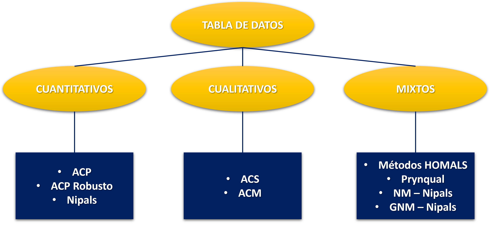
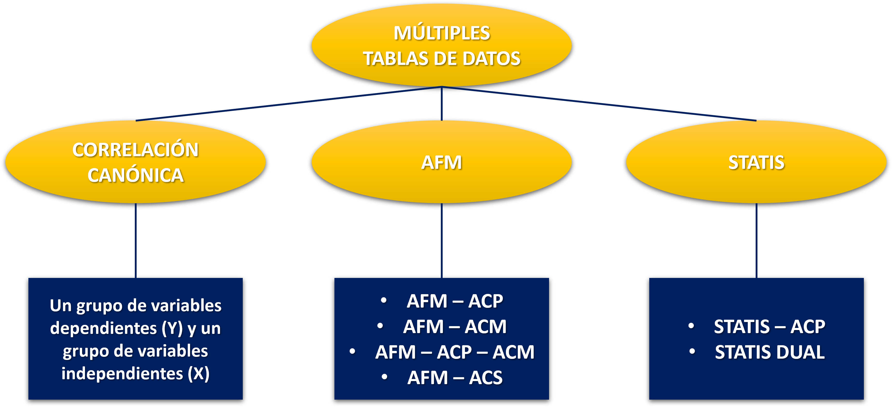
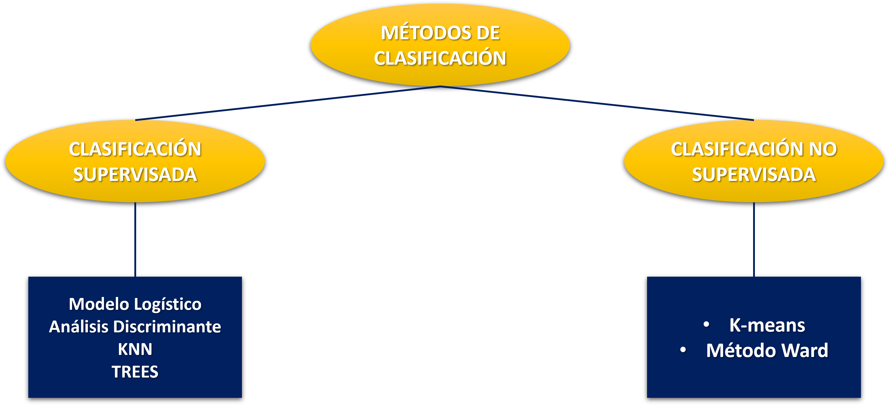
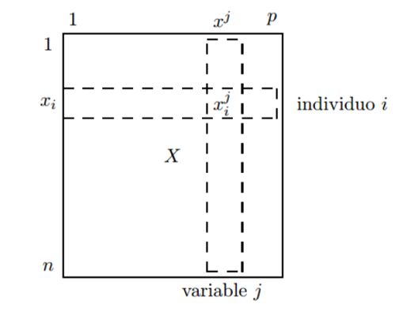
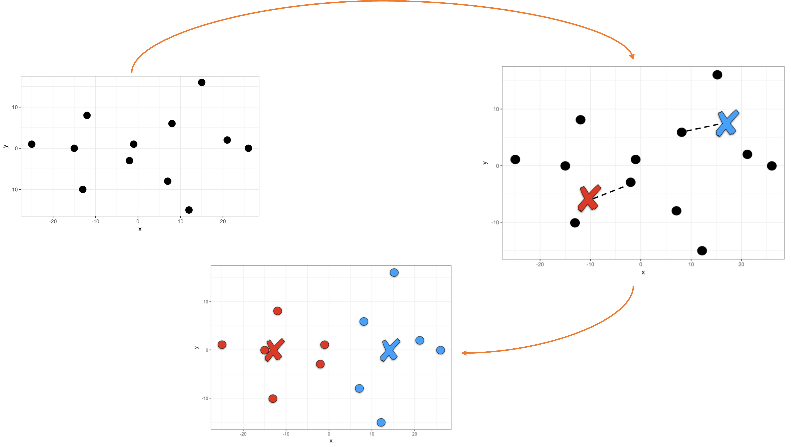
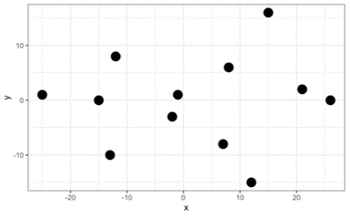
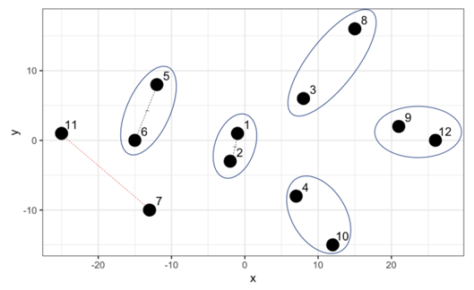
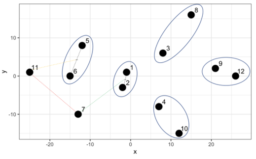
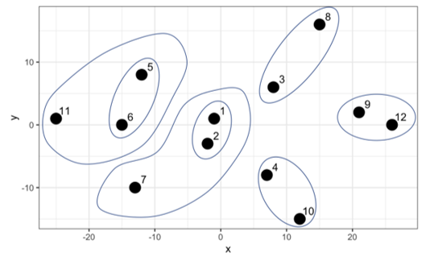
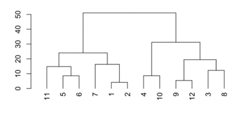

```{r setup, include = FALSE}
library(knitr)                              # paquete que trae funciones utiles para R Markdown
library(tidyverse)                          # paquete que trae varios paquetes comunes en el tidyverse
library(datos)                              # paquete que viene con datos populares traducidos al español :)
library(shiny)
# opciones predeterminadas
knitr::opts_chunk$set(echo = FALSE,         # FALSE: los bloques de código NO se muestran
                      dpi = 300,            # asegura gráficos de alta resolución
                      warning = FALSE,      # los mensajes de advertencia NO se muestran
                      error = FALSE)        # los mensajes de error NO se muestran


options(htmltools.dir.version = FALSE)
```

class: inverse, left, bottom
background-image: url("img/fondo.jpg")
background-size: cover


# **`r rmarkdown::metadata$title`**
----

## **`r rmarkdown::metadata$subtitle`**

### `r rmarkdown::metadata$author`
### `r rmarkdown::metadata$date`

```{r xaringanExtra-share-again, echo=FALSE}
xaringanExtra::use_share_again()
```

```{r xaringanExtra-clipboard, echo=FALSE}
xaringanExtra::use_clipboard()
```

---
name: hola
class: inverse, middle, center

# Universidad del Valle

--

## Maestría en Analítica e Inteligencia de Negocios


---


.pull-left[

<br><br><br><br><br>

```{r echo=FALSE, out.width = "110%" }
knitr::include_graphics("img/gif1.gif")
```
]

<br><br><br><br><br>


.pull-right[
# Orlando Joaqui-Barandica
### [www.joaquibarandica.com](https://www.joaquibarandica.com)
 *PhD.(C) in Industrial Engineering* 
 
 *MSc. Applied Economics*
 
 *BSc. Statistics*
]

---


name: Metodologia
class: inverse, center, middle

# `r icon("broom")`
# Análisis multivariado
----

.right[
.bottom[
####  [`r icon("bell")`](#menu)
]
]

---


# Análisis multivariado


.font120[En la era actual de la investigación en ciencias experimentales, la recopilación de datos implica la medición de múltiples variables en numerosas unidades de observación, lo que da lugar a la generación de extensos conjuntos de datos. ]

<br>

<hr>

<br>

> .font110[ `En estas circunstancias, el empleo de métodos estadísticos multivariados se vuelve esencial. Estos métodos permiten analizar de manera simultánea toda la información disponible, como sugieren Aluja y Morineau (1999).` ]

---

# Análisis multivariado

.font110[

El análisis de datos se fundamenta en la construcción de sistemas de información a partir de la matriz $X$, la cual puede contener:

- Variables cualitativas, 
- ... cuantitativas 
- ... o una combinación de ambas (datos mixtos). 

<br>
<br>

.orange[Dado que se manejan numerosas variables y se dispone de un gran número de observaciones para su análisis, el empleo de técnicas multivariadas se convierte en una herramienta fundamental.]

<br>

> Estas técnicas facilitan la descripción de las relaciones más significativas entre las variables y los individuos en el estudio, lo que posteriormente permite la identificación y caracterización de grupos dentro de la población de interés.

]


---

# Análisis multivariado

<br>

.font120[Dependiendo el tipo de matriz de datos que se tenga, se plantea el análisis
multivariado, en la práctica nos enfrentaremos a situaciones como las
siguientes: ]

<br>
<br>

### Matriz de datos solo cuantitativas (ACP)
### Matriz de datos solo cualitativas (ACS, ACM)
### Matriz de datos mixtos (AFM)


---

<br>
<br>

```{r, echo=FALSE, fig.align="center", out.width="90%"}

```


---

<br>
<br>


```{r, echo=FALSE, fig.align="center", out.width="90%"}

```


---

<br>
<br>


```{r, echo=FALSE, fig.align="center", out.width="90%"}

```

---


# Análisis multivariado

.font120[Requerimiento de los análisis clásicos

* La base de datos debe tener los registros completos
* El número de observaciones n debe superar el número de variables p

]

<br>

----

<br>

.font110[

> * Uno de los objetivos de estos análisis es extraer q variables latentes no correlacionadas,
las cuales son combinación lineal de las p variables originales.

<br>

> * Se desea encontrar las q variables, realizando una descomposición en vectores y valores propios de la matriz $W = X′X$ la cual contiene información de las variables originales.


]


---


# Objetivos

.font120[Algunos ejemplos para trabajar con métodos multivariantes


* Construcción de un índice para medir la capacidad economica de un individuo

* Análisis de la relación entre variables e individuos

* Segmentar una población en función de sus preferencias en consumo

<br>

Se puede decir que los métodos multivariantes servira como una etapa
intermedia a un análisis posterior, .orange[por ejemplo: un análisis de
regresión, clasificación, discriminación, entre otras.]
]

<br>

.center[
### Los métodos multivariantes sirven para comprender los datos.
]


---


name: Metodologia
class: inverse, center, middle

# `r icon("broom")`
# Análisis de componentes principales (ACP)
----

.right[
.bottom[
####  [`r icon("bell")`](#menu)
]
]

---


# ACP

.pull-left[

Uno de los objetivos fundamentales del análisis multivariado, y en particular del Análisis de Componentes Principales (ACP), es la **identificación y extracción de variables latentes no correlacionadas a partir de las variables originales.** 

<br>

> En este contexto, las .orange["variables latentes"] se refieren a características subyacentes que no son directamente observables, pero que influyen en los datos recopilados. 

> Estas variables latentes pueden representar fenómenos complejos o subyacentes que no se capturan de manera directa en las mediciones individuales.

]


.pull-right[


]


---


# ACP

.pull-left[

.font110[El ACP se destaca por su capacidad para transformar las variables originales en un nuevo conjunto de variables llamadas "componentes principales". 

----

Estas componentes principales son combinaciones lineales de las variables originales y están diseñadas de manera específica para que no estén correlacionadas entre sí. 

----


Esto significa que cada componente principal captura una parte única de la variabilidad en los datos, sin redundancias ni correlaciones con otras componentes.]

]


.pull-right[


```{r, echo=FALSE, fig.align="center", out.width="90%"}

```


]


---

# ACP

.font120[Este método permite reducir la dimensionalidad de los datos, transformando el conjunto de p variables originales en otro conjunto de q variables incorrelacionadas (q < p) llamadas componentes principales.]

<br>

$$
\begin{align*}
\psi_1 &= u_{11}X_1 + u_{21}X_2 + \ldots + u_{p1}X_p \\
\psi_2 &= u_{12}X_1 + u_{22}X_2 + \ldots + u_{p2}X_p \\
&\vdots \\
\psi_q &= u_{1q}X_1 + u_{2q}X_2 + \ldots + u_{pq}X_p
\end{align*}
$$

<br>

.font120[Las q componentes principales son obtenidas como combinaciones lineales
de las variables originales.]


---


# ACP

Los componentes se ordenan en función del porcentaje de varianza explicada. De tal manera, que el primer componente será el más importante por que explica mayor porcentaje de la variabilidad de los datos ( $\lambda_j$ valores propios $j = 1, .., p$).


$$\lambda_1 > \lambda_2 > \lambda_3 > ... > \lambda_p$$

----


### El ACP tiene la opción de usar la matriz de correlaciones o la matriz de covarianzas.

1. Opción: Matriz de correlación. En esta opción se le esta dando la misma importancia a todas la variables y éstas tienen diferentes escalas de medida (metros, kg, minutos, etc).

1. Opción: Matriz de covarianzas. Esta opción se utiliza cuando todas las variables tienen la misma escala de medida, y el investigador quiere analizar las variables en función del grado de variabilidad (ej: calificaciones del semestre 1:5)

En la mayoría de casos se trabaja el ACP normado $(Z_i = ( X_{ij} − \mu_j ) / \sigma_j$
), análisis dónde le damos la misma importancia a todas las variables de estudio.


---


name: Metodologia
class: inverse, center, middle

# `r icon("broom")`
# Aprendizaje supervisado
----

.right[
.bottom[
####  [`r icon("bell")`](#menu)
]
]

---


# Aprendizaje supervisado


Para entender el aprendizaje supervisado de forma intuitiva usaremos un ejemplo cotidiano. Todos hemos ido al doctor y alguna vez le hemos dicho que nos duele la garganta, que hemos tenido dolor de cabeza y fiebre. Éste nos hará unas cuantas preguntas más y luego nos dirá qué enfermedad podríamos tener y qué tratamiento seguir.

.pull-left[

Intuitivamente sabemos que el doctor tuvo que .orange[**entrenar**] inicialmente a partir de clases y libros donde muestran casos pasados, y estudiar qué síntomas son señal de cada enfermedad. Luego, empezó a .orange[**testear**] lo aprendido en un grupo de pacientes durante su internado. 

<br>

> Finalmente, cuando ya estaba entrenado tuvo licencia para poder aplicar este aprendizaje a pacientes en su consultorio u hospital.
]

.pull-right[


]

---


# Aprendizaje supervisado


Este es un ejemplo de aprendizaje supervisado porque el entrenamiento se realizó a partir de datos conocidos o inputs los cuales están etiquetados (duele la garganta, dolor de cabeza, fiebre) con la finalidad de obtener un resultado o output que también era conocido y etiquetado (¿tiene gripe o no?). 

.pull-left[
Cuando un doctor testea lo aprendido se sabe los inputs de pacientes y también el output que es dado por un doctor con más experiencia que puede decir qué tan efectivo es su entrenamiento. Cuando el doctor sale a atender pacientes solo tendrá inputs etiquetados con la finalidad de predecir un output etiquetado.


- knn
- Árboles de decisión
- Modelo logístico
- etc..

]


.pull-right[


]


---


name: Metodologia
class: inverse, center, middle

# `r icon("broom")`
# Aprendizaje no supervisado
----

.right[
.bottom[
####  [`r icon("bell")`](#menu)
]
]

---


# Aprendizaje no supervisado


Mientras que en el aprendizaje supervisado tenemos un conjunto de variables que usamos para predecir una determinada clase de salida (sube/baja, renuncia/no renuncia), en el aprendizaje no supervisado no tenemos clases de salida esperadas. 

.pull-left[


]


.pull-right[
En el aprendizaje supervisado teníamos data de entrenamiento y data de testeo que nos permitía validar la efectividad del modelo por la cercanía a la clase conocida. En el aprendizaje no supervisado no tenemos output predeterminado. 

<br>

> Esto genera a su vez un gran reto porque es muy difícil saber si ya culminamos con el trabajo o podemos aun generar otro modelo con el que nos sintamos más satisfechos.

]

---


# Aprendizaje no supervisado


.pull-left[

El ejemplo más sencillo para entender este tipo de aprendizaje es cuando tenemos nuestra base de clientes y queremos segmentarlos por primera vez. 

<br>

En ese caso buscamos clientes que se comporten de la misma forma, pero al ser la primera vez no sabemos cuántos segmentos podemos tener. El reto está en determinar el corte de 

<br>
<br>

.center[
.orange[.font120[**¿cuántos segmentos buscamos crear?.**]]
]

]


.pull-right[


]


---

# k-means


Este método nos permite agrupar a partir de la definición de centroides. Definiremos tantos centroides como grupos queremos obtener. 

El algoritmo k-medias coloca entonces en una primera iteración estos 2 puntos (centroides) de forma aleatoria en el plano. Luego, calcula la distancia entre cada centro y los demás puntos de la data. Si está más cercano a un centroide entonces lo asigna al centroide 1, sino al centroide 2.


```{r, echo=FALSE, fig.align="center", out.width="60%"}

```


---

# Agrupamiento jerárquico


.pull-left[
El agrupamiento jerárquico es otro método para agrupar datos. La palabra jerárquico viene a raíz de las jerarquías que este algoritmo crea para determinar los clusters. 

<br>

> A diferencia del k-medias no partimos indicando cuántos clusters queremos crear, sino que el algoritmo nos muestra un listado de combinaciones posibles de acuedo a la jerarquía de las distancias entre puntos.
]

.pull-right[

```{r, echo=FALSE, fig.align="center", out.width="90%"}

```


]


---


# Agrupamiento jerárquico


.pull-left[
Este algoritmo busca los dos puntos con la distancia más corta, los más cercanos, y los agrupa. Luego busca otros dos puntos con la menor distancia y pregunta: 

<br>

.center[
**¿la distancia entre estos dos nuevos puntos es menor que la distancia de estos puntos al grupo creado antes?**
]

<br>

Si la respuesta es sí los agrupa, sino agrupa el punto más cercano al primer grupo creado.

----

.orange[*Entendamos el algoritmo gráficamente.*] 


]

.pull-right[

```{r, echo=FALSE, fig.align="center", out.width="90%"}

```


- Los puntos 1 y 2 tienen la jerarquía más baja dado que tienen la distancia más corta. 
- Luego el algoritmo busca por los siguientes dos puntos más cercanos (el punto 9 y el 12) y al comparar con el punto medio del 1 y 2 opta por crear un nuevo grupo con una jerarquía ligeramente más alta y así sucesivamente.

]


---


# Agrupamiento jerárquico


.pull-left[
.font120[Sin embargo, ahora que tenemos el punto 7 y 11 y calculamos la distancia resulta que esa distancia no es la menor comparado a las distancias con los otros grupos existentes.]

<br>

.font120[Por ejemplo, el 7 está más cerca al punto medio del 1 y 2, y el 11 está más cerca al punto medio del 5 y 6.]
]

.pull-right[

```{r, echo=FALSE, fig.align="center", out.width="90%"}

```


]


---


# Agrupamiento jerárquico


.pull-left[


Así, el algoritmo crea una jerarquía más alta para esta agrupación.

```{r, echo=FALSE, fig.align="center", out.width="90%"}

```


]

.pull-right[

El algoritmo continua hasta que finalmente crea un grupo que contempla a todos como la jerarquía más alta. En el siguiente gráfico no solo podemos apreciar ello sino también en el eje y la distancia entre cada punto o grupo de puntos.

```{r, echo=FALSE, fig.align="center", out.width="90%"}

```


]


---


name: Metodologia
class: inverse, center, middle

# `r icon("broom")`
# En R...
----

.right[
.bottom[
####  [`r icon("bell")`](#menu)
]
]

---


# ACP Paso a Paso


```{r, warning=FALSE, message=FALSE, eval=FALSE, echo=TRUE}


#### ACP Paso a Paso para los estudiantes

### 1. Estandarizar los datos Z
### 2. Calcular la matriz de correlación, R=cor(X)=Z'NZ
### 3. Calcular los valores y vectores propios de cor, eigen(R)
### 4. Calcular las componentes principales T= Zu, u:vector propio
### 5. Graficar las componentes principales, plot(T1,T2)


mat <- c(7,7.5,7.6,5,6,7.8,6.3,7.9,6,6.8)
cie <- c(6.5,9.4,9.2,6.5,6,9.6,6.4,9.7,6,7.2)
esp <- c(9.2,7.3,8,6.5,7.8,7.7,8.2,7.5,6.5,8.7)

x <-matrix(c(mat,cie,esp),10,3) ## se crea una matriz con 10 filas y 3 columnas


rownames(x) <- c("Lucia","Pedro","Carmen","Luis","Andres","Ana","Carlos",
                 "Jose","Sonia","Maria") ## rownames nombre filas

colnames(x) <- c("Matematicas","Ciencias", "Espanol")

x

### 1. ESTANDARIZAR LA MATRIZ x.

z.mat <- (mat-mean(mat)) / sd(mat)
z.cie <- (cie-mean(cie))/ sd(cie)
z.esp <- (esp-mean(esp))/ sd(esp)

Z <- matrix(c(z.mat,z.cie,z.esp),10,3)
Z
### 2. MATRIZ DE correlacion de los datos x

R <- cor(x) ## cor(x) = cor(Z)
R
### 3. Calcular los valores y vectores propios

valoresyvectores <- eigen(R) ## calcular valores y vectores propios

u <- valoresyvectores$vectors ## vectores propios

### 4. Calcular las componentes principales Tcomp=Zu

Tcomp <- Z %*% u
Tcomp


### 5. Graficar las tcomp

plot(Tcomp[,1],Tcomp[,2],col="blue")
abline(h=0,v=0)
text(Tcomp[,1],Tcomp[,2]+0.12,row.names(x),cex=0.8)


```


---

# Clusters


```{r, warning=FALSE, message=FALSE, eval=FALSE, echo=TRUE}


library(tidyverse)


jugadores <- tibble(x = c(-1, -2, 8, 7, -12, -15, -13, 15, 21, 12, -25, 26),
                    y = c(1, -3, 6, -8, 8, 0, -10, 16, 2, -15, 1, 0)
)


jugadores %>% 
  ggplot() +
  aes(x, y) +
  geom_point(size = 5)


modelo_kmeans <- kmeans(jugadores, centers = 2)

# Imprimimos las coordenadas de los centros
modelo_kmeans$centers
#>           x          y
#> 1 -11.33333 -0.5000000
#> 2  14.83333  0.1666667


equipo <- modelo_kmeans$cluster


# Agregamos la columna del cluster
jugadores_agrupados <- jugadores %>% 
  mutate(cluster = equipo)

# Visualizamos los jugadores de acuerdo a la agrupación
jugadores_agrupados %>% 
  ggplot() +
  aes(x, y, fill = factor(cluster)) +
  geom_point(size = 9, pch = 21) +
  scale_fill_manual(values=c("#EE220D", "green")) +
  theme(legend.position = "none")


# Agrupamiento k >= 3

modelo_kmeans <- kmeans(jugadores, centers = 5)

equipo <- modelo_kmeans$cluster

jugadores_agrupados <- jugadores %>% 
  mutate(cluster = equipo)

jugadores_agrupados %>% 
  ggplot() +
  aes(x, y, color = factor(cluster)) +
  geom_point(size = 5) +
  theme(legend.position = "none")


##########################################################################


library(factoextra)

fviz_nbclust(jugadores, FUN = kmeans, method = "wss")

fviz_nbclust(jugadores, FUN = kmeans, method = "silhouette")


##########


url <- "http://archive.ics.uci.edu/ml/machine-learning-databases/00292/Wholesale%20customers%20data.csv"
clientes <- read_csv(url)

clientes

clientes_filtrado <- clientes %>% 
  select(Milk, Grocery, Frozen)


fviz_nbclust(clientes_filtrado, FUN = kmeans, method = "silhouette")


modelo <- kmeans(clientes_filtrado, centers = 2)

clientes_agrupados <- clientes_filtrado %>% 
  mutate(cluster = modelo$cluster)

clientes_agrupados


clientes_agrupados %>% 
  group_by(cluster) %>% 
  summarise(total = n(), 
            media_Milk = mean(Milk), 
            media_Grocery = mean(Grocery),
            media_Frozen = mean(Frozen))


library(reshape2)

data_long<- melt(clientes_agrupados, id = "cluster")

#Primer grafico
ggplot(data_long,aes(y= value, x= variable)) +
  geom_boxplot()

#Segundo Grafico
  ggplot(data_long,aes(y= value, x= variable, color = as.factor(cluster))) +
  geom_boxplot()


##################################################################
#Metodo de Ward o Jerarquico
  
  library(tidyverse)
  
  jugadores <- tibble(x = c(-1, -2, 8, 7, -12, -15, -13, 15, 21, 12, -25, 26),
                      y = c(1, -3, 6, -8, 8, 0, -10, 16, 2, -15, 1, 0)
  )

  
  dist_entre_jugadores <- dist(jugadores)
  
  
  modelo_jerarquico <- hclust(dist_entre_jugadores)

  
  
  library(dendextend)
  dend_modelo <- as.dendrogram(modelo_jerarquico)
  plot(dend_modelo)
    
  modelo_jerarquico
  
  
  corte <- 28
  
  dend_modelo %>% 
    color_branches(h = corte) %>% 
    color_labels(h = corte) %>% 
    plot() %>% 
    abline(h = corte, lty = 2)
  
  
  clusters_deseados <- 6
  
  dend_modelo %>% 
    color_branches(k = clusters_deseados) %>% 
    color_labels(k = clusters_deseados) %>% 
    plot()

  
  library(factoextra)
  fviz_nbclust(jugadores, FUN = hcut, method = "silhouette")
  

  


```


---


# Reducción de dimensionalidad y clusters


```{r, warning=FALSE, message=FALSE, eval=FALSE, echo=TRUE}


##################################################################
# Reducir la dimensionalidad
# ACP
  
  
  ##PCA:
    
  ##  library(stats)
  
  ##• prcomp() -> Forma rápida de implementar PCA sobre una matriz de datos.
  
  ##• princomp()
  
  ##library(FactoMineR)
  
  ##• PCA() -> PCA con resultados más detallados. Los valores ausentes se reemplazan por la media de cada columna. Pueden incluirse variables categóricas suplementarias. Estandariza automáticamente los datos.
  
  ##library(factoextra)
  
  ##• get_pca() -> Extrae la información sobre las observaciones y variables de un análisis PCA.
  
  ##• get_pca_var() -> Extrae la información sobre las variables.
  
  ##• get_pca_ind() -> Extrae la información sobre las observaciones.
  
  
  
  
  ##Visualizaciones:
    
  ##  library(FactoMineR)
  
  ##• fviz_pca_ind() -> Representación de observaciones sobre componentes principales.
  
  ##• fviz_pca_var() -> Representación de variables sobre componentes principales.
  
  ##• fviz_screeplot() -> Representación (gráfico barras) de eigenvalores.
  
  ##• fviz_contrib() -> Representa la contribución de filas/columnas de los resultados de un pca.
  
  
  library(factoextra)
  library(tidyverse)
  
  data(decathlon2)
  View(decathlon2)
  
  decathlon2.train <- decathlon2[1:23, 1:10]
  head(decathlon2.train[, 1:6])
  
  res.pca <- prcomp(decathlon2.train, scale = TRUE)
  
  fviz_eig(res.pca)
  
  
  fviz_pca_ind(res.pca,
               col.ind = "cos2", # Color by the quality of representation
               gradient.cols = c("#00AFBB", "#E7B800", "#FC4E07"),
               repel = TRUE    # Avoid text overlapping
               
  )
  
  
  
  fviz_pca_var(res.pca,
               col.var = "contrib", # Color by contributions to the PC
               gradient.cols = c("#00AFBB", "#E7B800", "#FC4E07"),
               repel = TRUE     # Avoid text overlapping
  )
  
  
  
  fviz_pca_biplot(res.pca, repel = TRUE,
                  col.var = "#2E9FDF", # Variables color
                  col.ind = "#696969",
                  axes=c(3,4)# Individuals color
  )
  
  
  
  ## Acceder a los resultados
  
  library(factoextra)
  # Eigenvalues
  eig.val <- get_eigenvalue(res.pca)
  eig.val
  
  # Resultados para Variables
  res.var <- get_pca_var(res.pca)
  res.var$coord          # Coordinates
  res.var$contrib        # Contributions to the PCs
  res.var$cos2           # Quality of representation 
  
  View(res.var$contrib[,1:3]) # Miro los dos primeros factores
  
  colSums( res.var$contrib[,1:2] )
  
  
  
  # Results for individuals
  res.ind <- get_pca_ind(res.pca)
  res.ind$coord          # Coordinates
  res.ind$contrib        # Contributions to the PCs
  res.ind$cos2           # Quality of representation 
  
  
  View(res.ind$contrib[,1:3]) # Miro los dos primeros factores
  
  res.ind$contrib[,1:2]
  
  
  
  # Utilizo un conjunto para predecir
  
  ind.test <- decathlon2[24:27, 1:10]
  head(ind.test)
  
  
  ind.test.coord <- predict(res.pca, newdata = ind.test)
  ind.test.coord[, 1:2] # Miro los primeros dos componentes
  
  ind.test.coord
  
  
  # Utilizo el gráfico anterior y le anexo los nuevos individuos
  
  p <- fviz_pca_ind(res.pca, repel = TRUE)
  
  fviz_add(p, ind.test.coord, color ="blue")
  
  
  
  

  
  ##############################################################################
  ##############################################################################
  # Factoclass
  
  
  library(FactoClass)
  
  resultado_ACP<-FactoClass(decathlon2.train,dudi.pca)
  2
  2
  4
  resultado_ACP$cluster
  
  
  NuevaBase<-data.frame(Cluster=resultado_ACP$cluster,decathlon2.train)  # unir base de datos con la nueva variable cluster
  
  View(NuevaBase)
  
  #Gráficos
  plot(resultado_ACP$dudi) # Grafico del análisis
  s.corcircle((resultado_ACP$dudi)$co)    
  s.label((resultado_ACP$dudi)$li,label=row.names(decathlon2.train)) #Graf. Individuos
  s.label((resultado_ACP$dudi)$co,xax=1,yax=2,sub="Componente 1 y 2",possub="bottomright") #Graf. Variables
  scatter(resultado_ACP$dudi,xax=1,yax=2) # Graf. Conjuntos
  
  Grupo<-NuevaBase$Cluster
  s.class((resultado_ACP$dudi)$li,Grupo,sub="Componentes 1 y 2",possub="bottomright",xax=1,yax=2,col=c(1,2,3,4))
  
  
  #Descripción de los grupos (Análisis de medias)
  resultado_ACP$carac.cont
  
  


```


---

class: inverse, center, middle
background-color: #122140

.pull-left[

.center[
<br><br>

# Gracias!!!

<br>


### ¿Preguntas?

<br>


```{r qr, echo=FALSE, fig.align="center", out.width="49%"}
knitr::include_graphics("img/qr-code.png")
```


]


]


.pull-right[

<br> 
<br> 


### [www.joaquibarandica.com](https://www.joaquibarandica.com)

`r icon("envelope")` orlando.joaqui@correounivalle.edu.co


]


<br><br><br>


